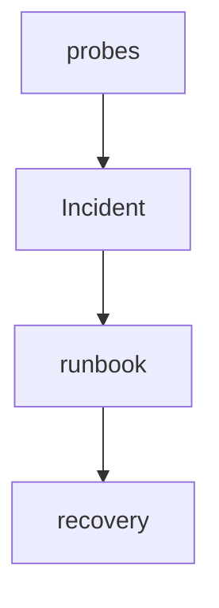

# PC 20 Incidents — debate e diagramas (M20)

**Unidade serial:** PC 20 · **Issue:** ANX-370 · **Status documental:** fechado
**Owner fisico:** `operations` (Incident + runbook). Nota P1: notes/anxionos-incident-management-graph.md.

## POSSUI

- Incident, runbook, postmortem refs
- Ligacao a deploy/recovery

## NAO POSSUI

- ChangeProposal de promocao — `governance`
- DecisionRecord de trade — `decisions`

## Fontes

- [atlas operations](./anxionos-diagram-atlas-modules.md)
