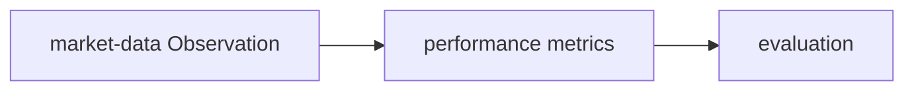

# PC 22 Analytics — debate e diagramas (M22)

**Unidade serial:** PC 22 · **Issue:** ANX-372 · **Status documental:** fechado
**Owners:** `performance` + `market-data`. **Sem pasta `analytics`.**

## POSSUI

- Series temporais / observacoes (`market-data`)
- KPIs agregados (`performance`)

## NAO POSSUI

- Preco ajustado como autoridade de ordem — so input para strategies/decisions
- Invoice — `billing`

## Fontes

- [atlas market-data](./anxionos-diagram-atlas-modules.md)
