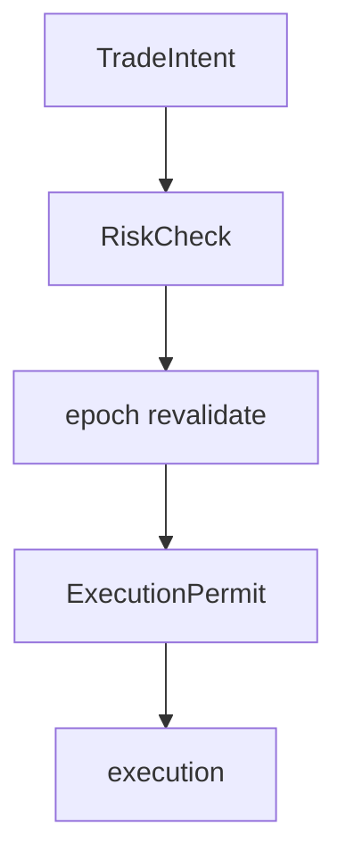

# PC 23 Decisions — debate e diagramas (M23)

**Unidade serial:** PC 23 · **Issue:** ANX-373 · **Status documental:** fechado
**Owner fisico:** `decisions`. **Nao** misturar com Approval institucional ([M01](./anxionos-pc01-governance-debate.md)).

## POSSUI

- DecisionRecord, TradeIntent, ExecutionPermit (apos risk + epoch)
- Contrato decision-record.v1 (ANX-265)

## NAO POSSUI

- Approval / ChangeProposal — `governance`
- RiskPolicy body — `risk`
- Order/Fill — `execution`

## Non-goals

- Nao emitir ExecutionPermit sem RiskCheck + epoch revalidate.

## Fontes

- [contrato](./anxionos-decision-engine-contract.md)
- [M01](./anxionos-pc01-governance-debate.md)
