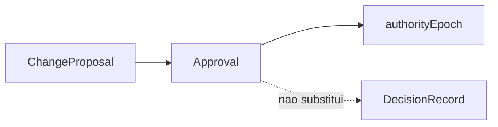

# PC 24 Approvals — debate e diagramas (M24)

**Unidade serial:** PC 24 · **Issue:** ANX-374 · **Status documental:** fechado
**Owner fisico:** `governance` (Approval + ChangeProposal). **CTO: nao criar pasta `approvals`.**

Fecha a capacidade Owner Approvals sem novo context. Ver [M01](./anxionos-pc01-governance-debate.md).

## POSSUI

- Approval APPROVED/REJECTED
- ChangeProposal SOFTWARE/INSTITUTIONAL

## NAO POSSUI

- DecisionRecord / ExecutionPermit — `decisions`
- Pasta approvals

## Non-goals

- Não criar pasta `approvals`.
- Approval não substitui DecisionRecord.

## Questoes abertas

Nenhuma para layout. Enforcement PolicyReference = D-GOV-010 / P06.
