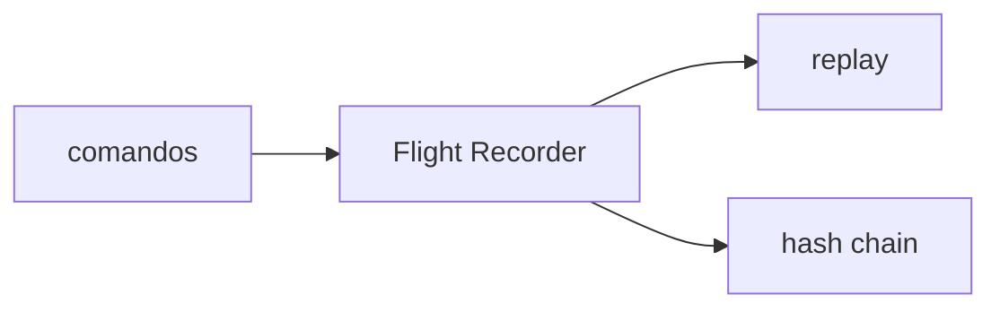

# PC 26 Audit — debate e diagramas (M26)

**Unidade serial:** PC 26 · **Issue:** ANX-376 · **Status documental:** fechado
**Owner fisico:** `audit`.

## POSSUI

- Flight Recorder, hash chain, replay
- Linhagem de comandos (nao substitui journal do dono)

## NAO POSSUI

- Grants — `governance`
- Ledger contabil — `accounting`

## Non-goals

- Audit não é dono de grants nem de ledger.
- Replay não reescreve journal do dono.

## Fontes

- [atlas audit](./anxionos-diagram-atlas-modules.md)
