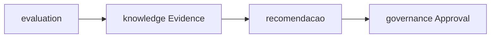

# PC 28 Learning — debate e diagramas (M28)

**Unidade serial:** PC 28 · **Issue:** ANX-378 · **Status documental:** fechado
**Owners:** `evaluation` + `knowledge` + `operations` (ciclo). **Sem pasta `learning`.**

## POSSUI

- Score/certificado (evaluation)
- Evidence/Memory (knowledge)
- Feedback operacional / intelligence loop (operations + notes P1)

## NAO POSSUI

- Auto-promocao sem Approval
- Pasta learning

## Non-goals

- Não criar pasta `learning`.
- Sem auto-promoção live sem Approval.

## Fontes

- [learning loop](./anxionos-agent-learning-loop.md)
