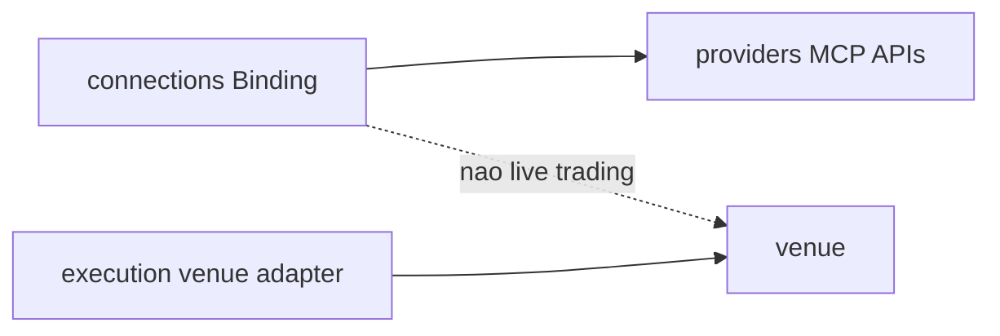

# PC 30 Integrations — debate e diagramas (M30)

**Unidade serial:** PC 30 · **Issue:** ANX-380 · **Status documental:** fechado
**Owner:** `connections` + adapters nos **modulos donos** (execution venues, etc.). **Nao** 24o modulo `adapter-gateway` (ADR0006).

Fecha o serial 01-30. Predecessor: [PC 29](./anxionos-pc29-marketplace-debate.md).

## POSSUI

- Bindings e adapters de inferencia/MCP/API em connections
- Adapters de venue em `execution` (nao connections REAL_EXECUTION)
- TASKBOARD kind em connections (espelho)

## NAO POSSUI

- Pasta integrations / adapter-gateway como context ADR0002
- Secrets em eventos

## Non-goals

- REAL_EXECUTION continua proibido v1 ([PC 07](./anxionos-pc07-connections-debate.md)).

## Questoes abertas

1. ADR formal de venue adapters vs connections — documentado nas fronteiras; sem novo context.

## Fontes

- [PC 07](./anxionos-pc07-connections-debate.md)
- [alinhamento](./anxionos-product-company-module-alignment.md)
