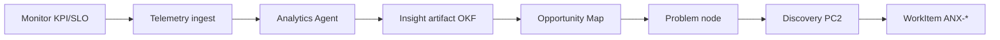

# Product Intelligence loop — Monitor → Problem → Discovery

## Escopo

Runbook P0 do ciclo **PC12 Product Intelligence** (framework: `.cursor/orchestration/AI-PRODUCT-COMPANY-ENGINE.md` §12). Fecha o loop:

```text
Users → Behavior → Telemetry → Analytics → Insights
  → New Opportunities → Product Changes → Discovery (PC2)
```

**Aresta Product Graph:** `Monitor` → `FEEDS_BACK` → `Problem` (`.cursor/orchestration/PRODUCT-GRAPH-SCHEMA.md`).

**Issue:** ANX-272 · **Dependência:** projeção graph P3 (ANX-271 proposed) — P0 usa OKF + taskboard.

---

## Agentes (taxonomia Owner)

| Agente | Status Cursor |
| --- | --- |
| Product Analytics Agent | proposed |
| Growth Agent | proposed |
| Customer Success Agent | proposed |
| Feedback Agent | proposed |
| Experimentation Agent | proposed |
| A/B Testing Agent | proposed |
| Optimization Agent | proposed |
| Innovation Agent | proposed |
| Product Strategist | proposed |

**Cobertura P0:** Helena (`researcher`) + Renata (`orchestrator`) em spikes manuais; `orchestration:phase -- company set --stage product-intelligence`.

---

## Fluxo operacional



### Entradas

- Métricas: latency p95/p99, error rate, adoption, business KPIs
- Feedback: suporte, issues GitHub, comentários taskboard
- Experimentos: resultados A/B (quando existir módulo `experiments`)

### Saídas

- `ResearchArtifact` em `brain/research/` ou `brain/notes/`
- `Problem` + `FEEDS_BACK` no Product Graph (exemplo abaixo)
- Issue `ANX-*` em `todo` com pacote G0
- Transição: `orchestration:phase -- company set --issue ANX-N --stage discovery`

---

## Ciclo manual demonstrado (P0)

**Cenário:** latência p99 do endpoint invite elevada após release.

| Passo | Ação | Evidência |
| --- | --- | --- |
| 1 | Registrar `Monitor` | `mon:invite-p99` threshold 500ms, atual 840ms |
| 2 | Criar `Insight` | nota OKF com query + screenshot/métrica |
| 3 | Materializar `Problem` | `prob:invite-latency-regression` |
| 4 | Aresta `FEEDS_BACK` | Monitor → Problem |
| 5 | Abrir issue | ANX-* "Investigar p99 invite" |
| 6 | Handoff Discovery | Marcus consult + Helena research spike |
| 7 | Fechar loop | PC12 → PC2 via `company set --stage discovery` |

Ver instância: `brain/notes/product-graph-examples/anx-272-product-intelligence-loop.md`.

---

## Queries Product Graph

### "O que a produção está nos dizendo?"

```text
Monitor (threshold breached)
  → FEEDS_BACK → Problem
  → DERIVES_FROM ← ResearchArtifact
  → TRACKED_IN → WorkItem ANX-N
```

### "Qual feature gerou este sinal?"

```text
Monitor → MONITORED_BY ← Deployment ← REALIZED_BY ← Feature
```

**P0 oráculo:** OKF `search product-intelligence FEEDS_BACK` + issue comentários.

---

## Integração Decision Engine

Mudanças de produto materiais (priorização, deprecação) exigem `DecisionRecord` scope `product` + autoridade L2+ (`.cursor/orchestration/DECISION-ENGINE-FRAMEWORK.md`).

---

## Critérios de aceite ANX-272

- [x] Loop documentado Monitor → Problem → Discovery
- [x] 1 ciclo manual demonstrado (exemplo grafo + passos)
- [x] Agentes e outputs mapeados
- [ ] Telemetria runtime autoritativa (P2+ módulo `analytics`)
- [x] Projeção FEEDS_BACK sandbox (ANX-278) — evento `product.intelligence.feeds_back.v1`

---

## Runtime sandbox (ANX-278)

**Evento:** `product.intelligence.feeds_back.v1` → nós `Monitor` + `Problem` + aresta `FEEDS_BACK`.

**Ciclo automático:**

```bash
bun test backend/tests/graph/product-intelligence-feeds-back.test.ts
npm run orchestration:product-intelligence -- --issue ANX-N --json
```

Saída: `nodesProjected: 2`, `edgesProjected: 1`, `discoveryStage: PC2`.

---

## CLI

```bash
npm run orchestration:phase -- company status --issue ANX-N
npm run orchestration:phase -- company set --issue ANX-N --stage product-intelligence
npm run orchestration:phase -- company next --from product-intelligence
```