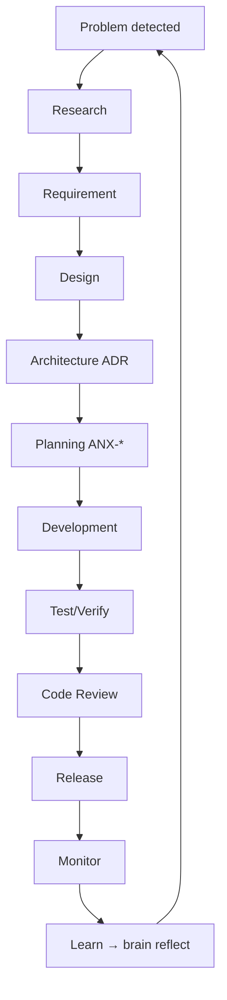

# Self-Development — empresa que evolui a si mesma

**Framework:** `.cursor/orchestration/AI-PRODUCT-COMPANY-ENGINE.md` §25 · **Issue:** ANX-280

## Visão

A AI Product Company desenvolve **novas capacidades para si mesma** — novos agentes, workflows, runbooks, módulos — via o mesmo pipeline G0–G7, nunca bypassando governança.

## Loop

## Pré-requisitos (P0 entregues)

- Decision Engine ANX-265
- Product/Agent Graph schema ANX-271
- Gates G0–G7 + pareamento executor-crítico

## Authority

| Ação | Nível mínimo |
| --- | --- |
| Propor capability nova | L2 Manager |
| ADR arquitetural | L4 CTO + Marcus |
| Deploy capability | L4 + G7 |
| Auto-modificar política global | **Proibido** — L6 Owner only |

## Product Graph

- `Problem` → `ResearchArtifact` → `Requirement` → `Feature` → `Capability`
- `Agent` CREATED → `CodeArtifact` (framework improvement)
- `Decision` APPROVED por Agent L4+

## Guardrails

1. Zero auto-expansão de grants/orçamento
2. DecisionRecord obrigatório para mudanças materiais
3. Crítico independente em todo slice G1
4. Self-dev **não** relaxa tolerância zero de código

## P2+ runtime (proposed)

- Agent `CapabilityEvolution` (proposed persona)
- Evaluation module certifica promoção L3/L4

## Critérios aceite P1 doc

- [x] Loop Mermaid + authority
- [x] Guardrails explícitos
- [x] Link pré-requisitos P0
- [ ] Demo 1 capability self-added (P3+)
