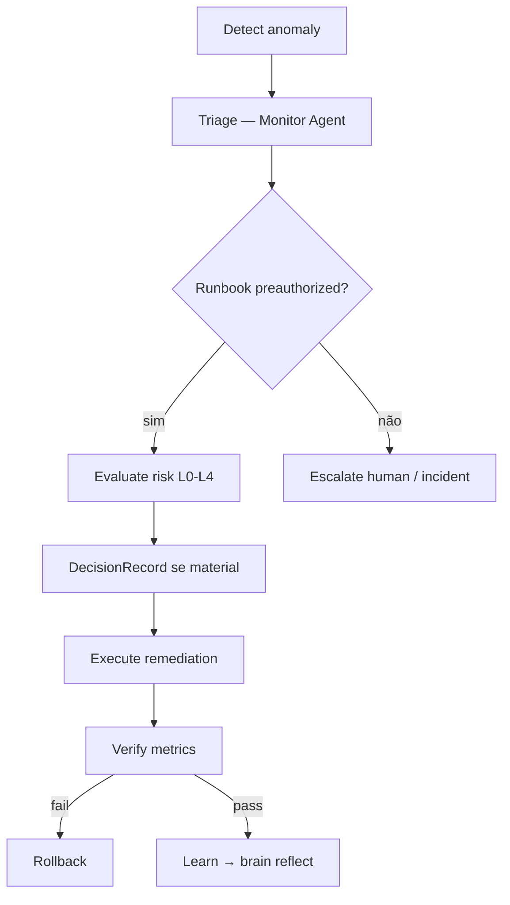

# Self-healing runbooks P1 — determinístico

## Escopo

Três runbooks **preautorizados** para remediação automática ou semi-automática em **sandbox/staging apenas** (P1). Alinhados a `.cursor/orchestration/AI-PRODUCT-COMPANY-ENGINE.md` §24.

**Issue:** ANX-273 · **Gate:** G4 Security (Isa) antes de ativar em qualquer ambiente · **Authority:** L0 worker executa; L4 CTO aprova ativação do runbook.

## Política

| Regra | Detalhe |
| --- | --- |
| Ambiente | `staging` ou `dev` **somente** — produção proibida até P2+ com G7 Owner |
| DecisionRecord | Obrigatório quando mudança afeta config autoritativa, pools, ou limites de negócio |
| Rollback | Cada runbook define rollback **antes** da execução |
| Evidência | Logs + métricas antes/depois em comentário `ANX-*` |
| G4 | Isa `verdict` PASS no runbook antes de `status: preauthorized` |

## Fluxo geral



---

## Runbook 1 — Redis connection pool exhaustion

**ID:** `sh-rb-001-redis-pool` · **Componente:** cache Redis · **Authority:** L1 Specialist (platform) · **DecisionRecord:** sim (config pool)

### Detecção

| Sinal | Threshold | Fonte |
| --- | --- | --- |
| `redis_latency_p99` | > 200ms por 5min | Monitor |
| `redis_connections_active` | > 90% max pool | Observability |
| Erros | `ECONNREFUSED` / `timeout` em logs API | Log aggregate |

### Pré-condições

- Ambiente = `staging` ou `dev`
- Runbook `status: preauthorized` (G4 PASS registrado)
- Snapshot config atual salvo (env + deployment revision)

### Remediação (determinística)

1. Registrar baseline: p99, active connections, pool `max`
2. Aumentar `REDIS_POOL_MAX` em +25% (cap absoluto documentado em ADR/env example)
3. Rolling restart **apenas** workers API (não Redis server)
4. Aguardar 3min; re-medir p99

### Rollback

1. Restaurar `REDIS_POOL_MAX` do snapshot
2. Rolling restart workers
3. Confirmar métricas ≤ baseline + 10%

### Verificação

- p99 < 200ms por 10min
- Zero `ECONNREFUSED` novos

### DecisionRecord (template)

```text
scope: engineering
proposal: Increase REDIS_POOL_MAX +25% on staging
requiredAuthority: L4
affectedEntities: [svc:api, deployment:staging]
```

---

## Runbook 2 — HTTP 5xx rate spike (API)

**ID:** `sh-rb-002-http-5xx` · **Componente:** `backend/apps/api` · **Authority:** L1 · **DecisionRecord:** não (restart canário pré-aprovado)

### Detecção

| Sinal | Threshold |
| --- | --- |
| `http_5xx_rate` | > 1% por 3min |
| `health_check` | `/health` falha 2/3 probes |

### Pré-condições

- Staging/dev only
- Último deploy < 24h (senão → incident manual, não auto-heal)

### Remediação

1. Capturar revision atual (`DEPLOY_REVISION`)
2. Canary restart: 1 instância API
3. Se health OK em 2min → rolling restart restante
4. Se health FAIL → **abort**, não prosseguir

### Rollback

1. `rollback` para `DEPLOY_REVISION` capturada
2. Verificar 5xx < 0.1% por 10min

### Verificação

- G3 smoke: `bun test` contract subset documentado na issue
- p95 latency estável ±15%

---

## Runbook 3 — PostgreSQL connection saturation

**ID:** `sh-rb-003-pg-pool` · **Componente:** PostgreSQL pool (app) · **Authority:** L2 Manager · **DecisionRecord:** **sim** (pool + timeout)

### Detecção

| Sinal | Threshold |
| --- | --- |
| `pg_connections_waiting` | > 10 por 5min |
| `pg_pool_utilization` | > 85% |

### Pré-condições

- Staging/dev
- G4 PASS no runbook
- **Não** executar se queries lentas > 5s (→ incident, não pool)

### Remediação

1. Snapshot `DATABASE_POOL_MAX`, `DATABASE_IDLE_TIMEOUT`
2. Reduzir `idle_timeout` em 20% (liberar conexões ociosas)
3. Se ainda > 85% após 5min: aumentar `pool_max` +10% (cap em env example)
4. Re-medir

### Rollback

1. Restaurar ambos valores do snapshot
2. Restart workers (não PG server)
3. Confirmar `pg_pool_utilization` < 70%

### DecisionRecord

Obrigatório antes de alterar `pool_max` — scope `engineering`, L4 CTO.

---

## Catálogo e status

| ID | Nome | DecisionRecord | G4 | Status |
| --- | --- | --- | --- | --- |
| sh-rb-001 | Redis pool | sim | pending | proposed |
| sh-rb-002 | HTTP 5xx restart | não | pending | proposed |
| sh-rb-003 | PG pool | sim | pending | proposed |

## Critérios de aceite ANX-273

- [x] 3 runbooks com detecção, remediação, rollback, verificação
- [x] Sandbox-only explícito
- [x] DecisionRecord quando material
- [x] G4 obrigatório documentado
- [ ] Execução real em staging (P2 — fora escopo P0 doc)
- [ ] Automação agente SRE (P2 proposed)

## CLI / evidência P0

```bash
# OKF
search "self-healing runbook sh-rb-001"

# Orchestration
npm run orchestration:phase -- company set --issue ANX-273 --stage operations
```

**Framework:** `.cursor/orchestration/AI-PRODUCT-COMPANY-ENGINE.md` §22–24