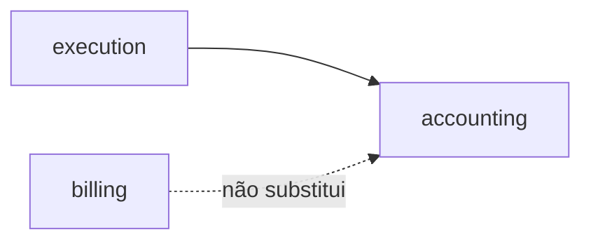

# Thin debate — accounting (spec 003 / ADR0002)

**Issue:** ANX-389 · Módulo `accounting`. Único ledger financeiro.

## POSSUI

Ledger, taxas, reversões, ajustes, reconciliação.

## NÃO POSSUI

Invoices de plataforma (`billing`), comissões (`partners`), posições (`portfolios`).

## Non-goals

Segundo ledger Neo4j ou SQLite.

