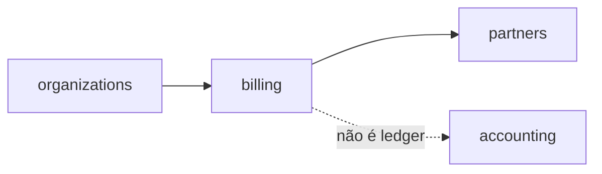

# Thin debate — billing (spec 003 comercial / ADR0002)

**Issue:** ANX-389 · Módulo `billing` (P07). Não é ledger de trading.

## POSSUI

Assinaturas da plataforma, invoices, refunds, idempotência de webhooks.

## NÃO POSSUI

Lançamentos de trading (`accounting`), payouts (`partners`).

## Non-goals

Cobrança confirmada em SQLite.

