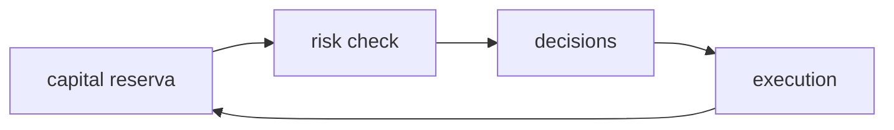

# Thin debate — capital (spec 003 / ADR0002)

**Issue:** ANX-389 · Módulo `capital`. Sem 24º módulo.

## POSSUI

Conta de capital, titular, alocações, reservas (HELD/release/consume/expiry).

## NÃO POSSUI

Ledger comercial (`accounting`), posições (`portfolios`), ordens (`execution`), PolicyVersion RISK (`risk`). SQLite não guarda saldo.

## Non-goals

Não ser segundo ledger. D-GOV-010 não aplica aqui.

