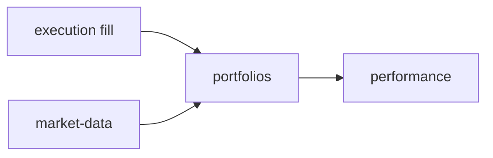

# Thin debate — portfolios (spec 003 / ADR0002)

**Issue:** ANX-389 · Módulo `portfolios`.

## POSSUI

Posições canônicas, valuation, exposição; séries derivadas Timescale (ADR0004).

## NÃO POSSUI

Ledger (`accounting`), fills autoritativos (`execution`), instrumentos mestres (`market-data`).

## Non-goals

Cache local com asOf nunca decide risco.

