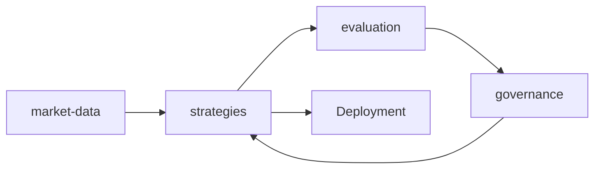

# Thin debate — strategies (spec 003 / ADR0002)

**Issue:** ANX-389 · **Módulo físico:** `strategies` · Sem pasta nova. PC serial não cobriu este módulo (taxonomia 30 ≠ 23).

## POSSUI

StrategyVersion, parâmetros/hash, Deployment, estado de backtest. Publicação ≠ backtest executado.

## NÃO POSSUI

| Item | Dono |
| --- | --- |
| Certificação/promoção auto | evaluation |
| Approval de change | governance |
| Ordens | execution |
| Ticks | market-data |

## Non-goals

Não criar pasta `products/` (PC 10). evaluation certifica; strategies aplica versão.

Fontes: spec 003 draft · [R-pack](../docs/orchestration/modules/strategies/ROUNDS.md) · [PC índice](./anxionos-pc-serial-index.md).
