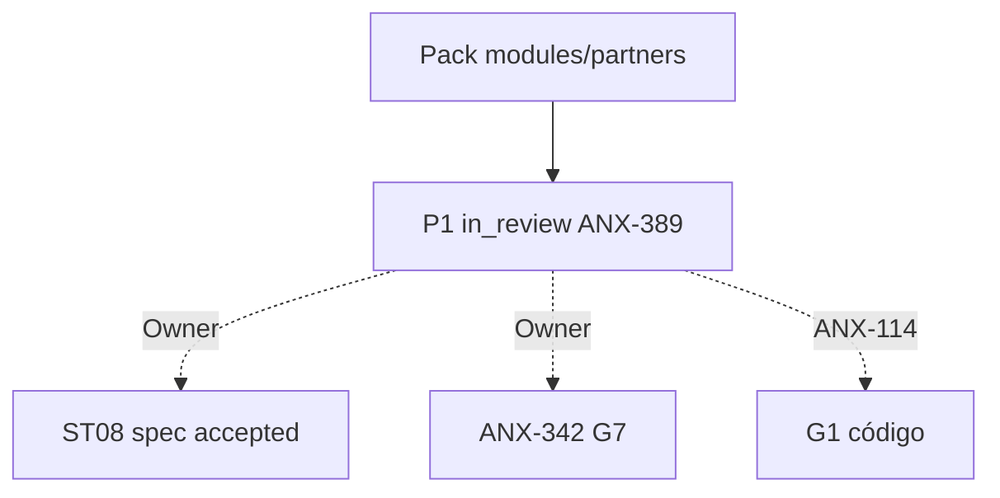

# R10 — Pacote G0 (handoff): `modules/partners`

**Rodada:** R10  
**Data:** 2026-09-11  
**Issues:** ANX-389 (pack P1) · ANX-113 (debate histórico) · **ANX-114** (impl — **não** executada)  
**Callers:** [R09-dev-plan.md](./R09-dev-plan.md) · [ROUNDS.md](./ROUNDS.md). Sem código de produto. Specs 001–005 **draft**. ANX-342 permanece `todo`. D-GOV-010 = **risk P06**.

## Classificação epistemológica

| Afirmação | Status |
| --- | --- |
| Debate R01–R10 neste dir | fechado P1 documental |
| Specs 001–005 | **draft** (ST08 0/23) |
| ANX-342 | **todo** — não hijack |
| D-GOV-010 | **risk P06** — fora |
| Pasta marketplace/ | **não criar** (PC 29) |
| Código `backend/modules/partners` | pack ≠ G1/G7 |

## In scope documental

| Área | Entrega |
| --- | --- |
| Domínio | Referral, CommissionRule, Accrual, Reversal, PayoutBatch |
| Contratos | `@anxionos/contracts/partners/*` + eventos R04 |
| Persistência nomeada | PostgreSQL `partners_referrals`, `partners_commission_rules`, `partners_accruals` UNIQUE (invoice_id, referral_id), `partners_reversals` UNIQUE (refund_id), `partners_payout_batches`, `partners_command_journal` |
| Grafo | projector `graph:partners:v1` — só ids |
| API | `/v1/partners` esboço R04 |
| Testes | G3-PTR-* / G5-PTR-* abaixo |

## Out of scope

| Item | Destino |
| --- | --- |
| Invoice / webhook PSP | billing |
| Ledger / journal de capital | accounting |
| Pasta marketplace/products | PC 29 — não criar |
| Neo4j driver | graph |
| D-GOV-010 / kill switch | risk P06 |
| Spec `accepted` | Owner + checklist |
| ANX-342 G7 | Owner |
| G1 código ANX-114 | issue distinta |

## Non-goals

- Nenhuma migration ST08 neste pack.
- SQLite **não** é payout autoritativo.
- Partners **não** emite `billing.*` nem `accounting.journal.*` (PTR-R04-01).
- Accrual só após `billing.invoice.paid.v1`; reverse só após refund processado.
- Sem pasta `approvals/` / `policies/`.

## Oráculos G3 / G5 (fecho do pack)

| ID | Gate | Esperado |
| --- | --- | --- |
| G3-PTR-01 | G3 | `invoice.paid.v1` → um único accrual |
| G3-PTR-02 | G3 | paid replay → mesmo `accrual_id` (UNIQUE invoice+referral) |
| G3-PTR-03 | G3 | refund → reverse idempotente (UNIQUE refund_id) |
| G3-PTR-04 | G3 | payout FAILED retry não duplica SETTLED |
| G3-PTR-05 | G3 | accrue unpaid → 409 `PTR_ACCRUAL_UNPAID` |
| G5-PTR-01 | G5 | GET referral outra org → 403 |
| G5-PTR-02 | G5 | paid replay um accrual (cross-check G3-PTR-02) |
| G5-PTR-03 | G5 | refund reverse único |
| G5-PTR-04 | G5 | T01 DENY → 403 `PTR_GRANT_INVALID` |
| G5-PTR-05 | G5 | accrue unpaid → 409 |

## Critérios de aceite **deste** pack (P1 documental)

| # | Critério |
| --- | --- |
| AC-P1-01 | In/out/non-goals explícitos |
| AC-P1-02 | Oráculos G3/G5 nomeados |
| AC-P1-03 | Tabelas PG nomeadas em R05 + R10 |
| AC-P1-04 | Decision log R08 com P1-PTR-* |
| AC-P1-05 | R09 **sem** greenlight G1 |

**Veredito P1:** G0 documental completo. **Não** autoriza G1. Próximo serial: [operations](../operations/ROUNDS.md).

## Saída R10

G0 debate P1 fechado. ANX-389 evidência — não G7. ANX-342 `todo`. Specs 001–005 **draft**.
