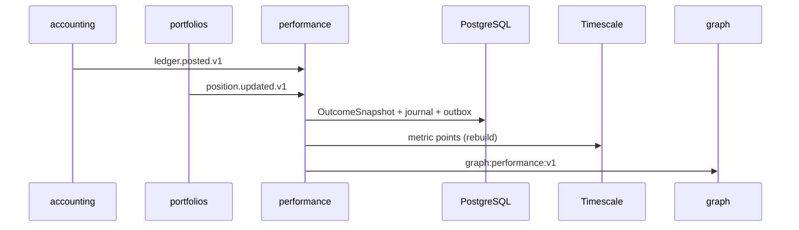

# R05 — Armazenamento: `modules/performance`

**Rodada:** R5 · 2026-09-11 · ANX-389 · ANX-105 · **ANX-106** não impl  
**Callers:** [R04-contracts-events.md](./R04-contracts-events.md) · [R06-dependencies.md](./R06-dependencies.md) · [ROUNDS.md](./ROUNDS.md).  
ADR0004: PostgreSQL autoritativo; Timescale **derivado**; Neo4j via `graph:performance:v1`; SQLite **não** oficial. Storage map **draft**; ST08 **0/23**. **Sem migration.** D-GOV-010 = **risk P06**.

## In scope (engines nomeados)

| Engine | O que performance **possui** |
| --- | --- |
| PostgreSQL | `performance_metric_definitions`, `performance_outcome_snapshots`, `performance_attribution_runs`, `performance_command_journal` |
| Timescale | `performance_metric_points`, `performance_pnl_series` (hypertables read-model) |
| Neo4j | projector `graph:performance:v1` — ids de snapshot; **não** P&L como saldo |

## Out of scope

| Dado | Dono |
| --- | --- |
| Ledger / journal | accounting |
| Posição autoritativa | portfolios |
| Fill / ordem | execution |
| Certificação | evaluation |
| Kill switch / D-GOV-010 | risk P06 |
| Pasta analytics/ 24º | **proibido** (PC 22 composto) |
| SQLite série oficial | **proibido** |

## Non-goals

Série Timescale **não** é saldo. Sem FK accounting. Sem migration. Specs draft. Attribution **não** certifica estratégia.

## Princípios

| Princípio | Decisão |
| --- | --- |
| Snapshot / definition | PostgreSQL `performance_*` |
| Séries | Timescale hypertables rebuildáveis |
| Journal/outbox | mesma transação PG |
| FK cross-module | **Não** |
| Série = saldo | **Proibido** |
| `asOfRevision` | reject stale vs ledger/position |

## Tabelas (alvo G1 — sem migration neste pack)

| Tabela | Engine | Propósito |
| --- | --- | --- |
| `performance_metric_definitions` | PostgreSQL | MetricDefinition versionada |
| `performance_outcome_snapshots` | PostgreSQL | OutcomeSnapshot + asOfRevision |
| `performance_attribution_runs` | PostgreSQL | AttributionRun idempotente |
| `performance_command_journal` | PostgreSQL | command_id PK |
| `performance_metric_points` | Timescale | pontos rebuildáveis |
| `performance_pnl_series` | Timescale | série P&L **não** ledger |

**PERF-R05-01** PG autoritativo. **PERF-R05-02** UoW+outbox. **PERF-R05-03** RLS defer P09. **PERF-R05-04** Timescale derivado — rebuild validator.

## Oráculos

| ID | Gate | Esperado |
| --- | --- | --- |
| G3-PERF-01 | G3 | outcome idempotente (`performance_command_journal`) |
| G3-PERF-02 | G3 | série Timescale **não** UPDATE `accounting` ledger |
| G3-PERF-03 | G3 | evaluation consome `recorded`; **não** certifica aqui |

## Alternativas rejeitadas

SQLite oficial; Timescale como ledger; FK accounting; pasta `analytics/`.

## Saída R5

Modelo v1 para R6. Nenhuma migration.
