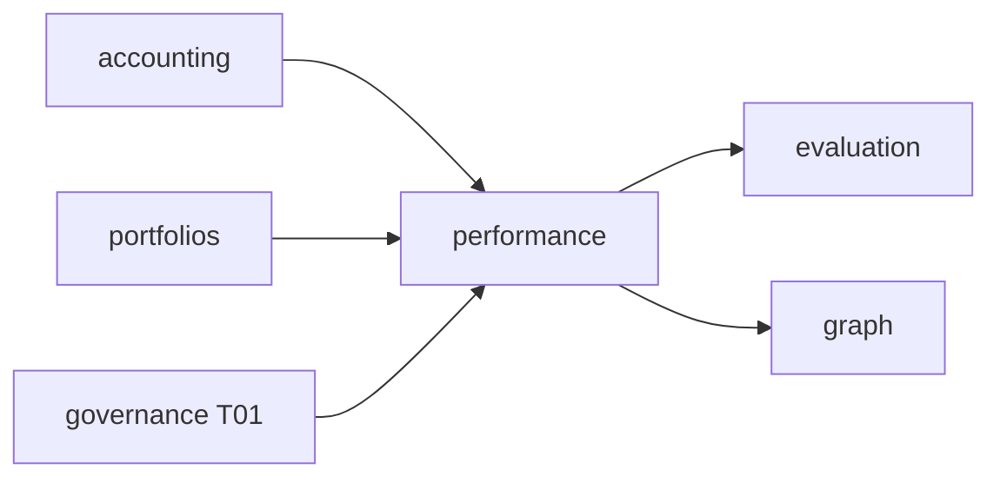

# R06 — Dependências: `modules/performance`

**Rodada:** R6 · 2026-09-11 · ANX-389 · ANX-105 · **ANX-106** não impl  
**Callers:** [R05-storage-pg.md](./R05-storage-pg.md) · [R07-risks.md](./R07-risks.md) · [ROUNDS.md](./ROUNDS.md). Sem API runtime. D-GOV-010 = **risk P06**.

## Decisões-chave

| ID | Decisão |
| --- | --- |
| PERF-R06-01 | Consome accounting + portfolios; fill só cross-check |
| PERF-R06-02 | T01 `performance.read` / admin fail-closed |
| PERF-R06-03 | Projector `graph:performance:v1` no **graph** |
| PERF-R06-04 | Não importa `accounting/infrastructure/**` |
| PERF-R06-05 | evaluation/billing consomem eventos — billing usage ≠ P&L trading |
| PERF-R06-06 | Journal/outbox mesma UoW PG |
| PERF-R06-07 | Timescale write só no adapter de série — domain não importa driver |
| PERF-R06-08 | D-GOV-010 não é deste módulo (risk P06) |
| PERF-R06-09 | AgencyScopePort — sem FK organizations |
| PERF-R06-10 | Sem pasta `analytics/` |

## Upstream

| Módulo | Port / evento | Uso |
| --- | --- | --- |
| accounting | `ledger.posted.v1` | realized |
| portfolios | `position.updated.v1` | asOfRevision |
| execution | fill confirm | reconciliação (não dono) |
| decisions / strategies | ids | attribution |
| identity / organizations / governance | actor + T01 | |
| packages/eventing | journal/outbox | |
| packages/contracts | performance/* | |

## Downstream

| Consumidor | Contrato |
| --- | --- |
| evaluation | `performance.outcome.recorded.v1` |
| billing | reports (usage ≠ P&L) |
| operations | health de rebuild |
| audit | subscriber |
| graph | `graph:performance:v1` |
| frontend Owner | snapshots |

## Imports proibidos

`accounting/infrastructure/**`, `portfolios/infrastructure/**`, `neo4j-driver`, secrets em `domain/`.

## Oráculos de fronteira

| ID | Esperado |
| --- | --- |
| G3-PERF-01 | command journal idempotente |
| G3-PERF-02 | Timescale não UPDATE ledger |
| G3-PERF-03 | evaluation não certifica neste módulo |

## Saída R6

Mapa v1 para R7.
