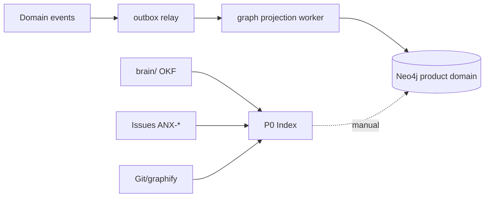

# ADR0005 — Product Graph como projeção Neo4j (P3 proposed)

## Status

**Accepted** — greenlight Owner ANX-276; sandbox P2 homologado ANX-290; staging P3 em ANX-292.

> **Colisão de número (ANX-455).** Existe um *outro* ADR0005 em `brain/project-docs/decisions/0005-agent-hierarchy-modes-triangular-circular.md`, sobre **hierarquia de agentes** (draft) — assunto distinto. Este documento permanece **accepted** e prevalece para Product Graph / Neo4j. Identificar por caminho + título. Registro: [docs/document-precedence.md](../../docs/document-precedence.md).

## Contexto

A AI Product Company Engine requer um sistema operacional cognitivo que conecte problemas, requisitos, features, código, testes, deploys, agentes, decisões e sinais. Em P0, o Product Graph é indexado via OKF (`brain/`) + issues `ANX-*` + graphify (ver spec 006 e PRODUCT-GRAPH-SCHEMA.md).

O grafo institucional de runtime (`backend/modules/graph/`) já usa Neo4j para projeções governadas por eventos (ADR0001 proposed, ADR0004 accepted para stack). Precisamos decidir se Product Graph e Agent Graph compartilham a mesma instância/projeção ou permanecem separados.

## Decisão proposta

1. **Product Graph e Agent Graph são projeções read-only** derivadas de eventos com `eventId`, `checkpoint` e `ownerDomain`.
2. **Projeção Neo4j em P3** usa schema registry no módulo `graph` com `ownerDomain: product` e `ownerDomain: agents` distintos do grafo institucional operacional.
3. **P0–P2 permanecem sem Neo4j obrigatório** — OKF + taskboard + graphify são suficientes para rastreabilidade.
4. **Nenhum nó do Product Graph concede autoridade** — grants, mandates e approvals permanecem em `governance`.
5. **Deleção de nós = evento de tombstone**, não remoção silenciosa.

## Alternativas consideradas

| Alternativa | Prós | Contras | Decisão |
| --- | --- | --- | --- |
| A. Mesmo grafo Neo4j institucional | Menos infra | Mistura produto com capital/ordens; blast radius | Rejeitada |
| B. Grafo separado Product+Agent em Neo4j | Isolamento, queries dedicadas | Custo operacional extra | **Proposta** |
| C. Apenas OKF/graphify (sem Neo4j) | Zero infra P3 | Queries complexas lentas em escala | P0–P2 only |
| D. PostgreSQL JSONB para grafo produto | Stack unificada | Traversal pobre vs Neo4j | Rejeitada para P3+ |

## Consequências

### Positivas

- Queries de impacto e responsabilidade executáveis em Cypher (spec 006)
- Separação clara produto vs runtime institucional
- Rebuild reconstruível a partir de journal/outbox

### Negativas / riscos

- Neo4j P3 ainda não homologado em produção
- Duplicação de schema registry (institucional + product)
- Sincronização OKF ↔ Neo4j requer pipeline de ingestão

### Mitigações

- Issue ANX-271 com gate G2 arquitetura antes de código
- Fixtures F0 em sandbox; sem capital real
- CLI `orchestration:product-graph` em P1 como oráculo Cursor antes de Neo4j

## Implementação (quando aceito)

Módulos afetados: `graph` (schema registry), `audit` (linhagem), apps/workers (projection worker). Sem alteração em `governance`, `decisions` ownership.

## Critérios de aceite

- [x] ADR aceito pelo Owner (ANX-276)
- [x] Spec 006 atualizada com referência a este ADR
- [x] ANX-271 claimada com matriz requisito→teste
- [x] Projeção reconstruível demonstrada em sandbox (ANX-290)
- [x] Zero escrita direta de agentes no grafo sem evento
- [ ] Homologação staging (ANX-292) e produção (fase posterior)

## Referências

- brain/project-docs/specs/006-product-agent-graph/spec.md
- brain/project-docs/decisions/0004-postgresql-timescaledb-pgvector.md
- .cursor/orchestration/PRODUCT-GRAPH-SCHEMA.md
- ANX-271 (Graph projection schema P3)