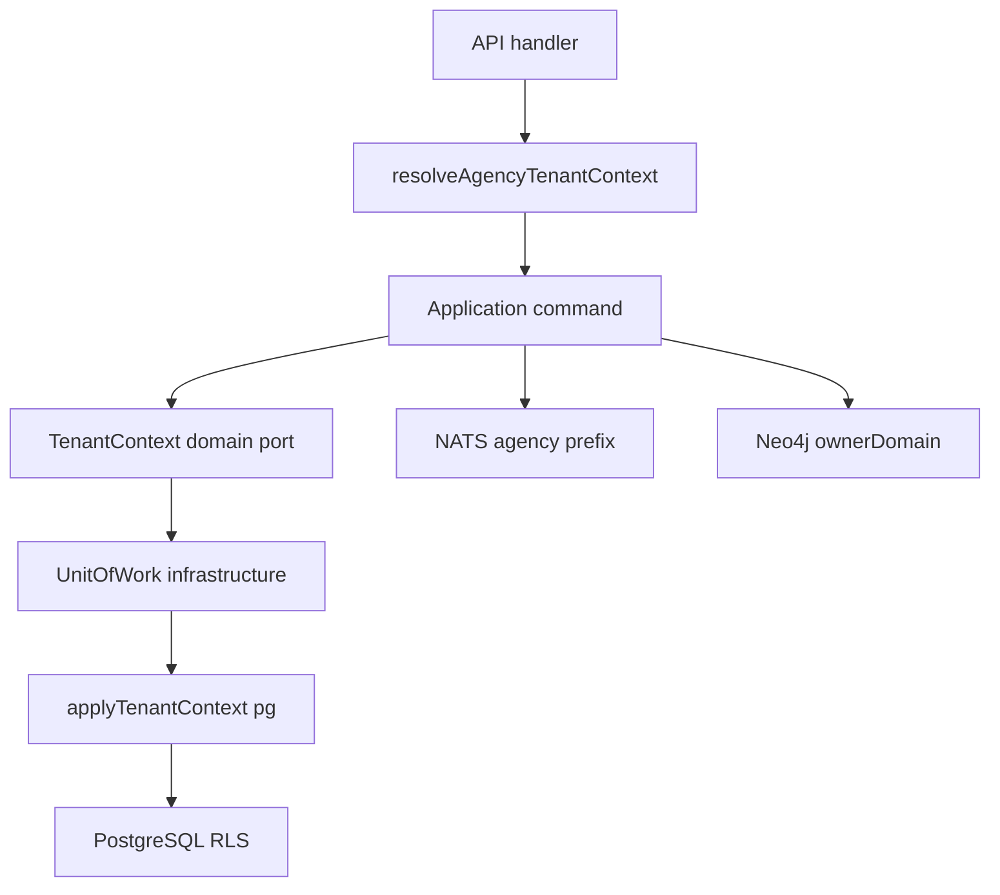

# ADR0006 — Agency como container de tenant

## Status

**Accepted** — implementado em ANX-256 (RLS), ANX-257 (NATS prefix), ANX-258 (Neo4j ownerDomain), ANX-259 (API bootstrap + Pattern B UoW).

## Contexto

anxionOS é multi-tenant: cada agência opera com capital, grants, memberships e dados isolados. Precisamos de um boundary único e auditável que:

1. Propague para PostgreSQL RLS (`app.tenant_id`, `app.agency_id`)
2. Isole assinaturas NATS JetStream por agência
3. Marque projeções Neo4j com `ownerDomain` + escopo de agência
4. Respeite ADR0002 — camada `application` não importa `@anxionos/database`

Até existir tenant de plataforma (SaaS operator acima de múltiplas agencies), **Agency = tenant**.

## Decisão

1. **`tenantId` = `agencyId`** em todo contexto de request/job até modelo de platform-tenant.
2. **Pattern B (híbrido):** `TenantContext` é port de domínio (`domain/ports/tenant-context.ts`); infraestrutura adapta via `applyTenantContext` do pacote `@anxionos/database`.
3. **UoW explícito:** comandos passam `TenantContext` para `runInTransaction`; queries usam guards de escopo (`assertAgencyScope`).
4. **PostgreSQL RLS:** políticas usam `current_setting('app.tenant_id')` e `current_setting('app.agency_id')`; pool `app` rejeita `bypassRls`.
5. **NATS:** subject `agency.{agencyId}.events.{eventType}`; stream `EVENTS` inclui `agency.>.events.>`.
6. **Neo4j:** nós institucionais carregam `ownerDomain` do módulo dono; projeções agency-scoped incluem `agencyId` no payload do evento.
7. **API bootstrap:** `resolveAgencyTenantContext(agencyId, principalId)` no composition root (`apps/api`).

## Alternativas consideradas

| Alternativa | Prós | Contras | Decisão |
| --- | --- | --- | --- |
| A. Organization como tenant | Modelo SaaS clássico | Organization ainda não modelada; Agency já é unidade operacional | Rejeitada (fase atual) |
| B. Agency = tenant (1:1) | Alinha com RLS/NATS já implementados | Migração futura se platform-tenant surgir | **Aceita** |
| C. TenantContext só em `@anxionos/database` | Um tipo | Viola AR01 — application importaria database | Rejeitada |
| D. Bypass RLS no pool app | Debug fácil | Falha de isolamento | Proibida (RLS-04) |

## Consequências

### Positivas

- Isolamento verificável (RLS-ORG-01/02, G3/G5 oracles, fixture `orgs-two-agencies`)
- Boundary AR01 limpo — ports em domain, adapters em infrastructure
- NATS e grafo seguem o mesmo identificador de escopo

### Negativas / riscos

- Renomear tenant quando platform-tenant existir exige migração de políticas e subjects
- `findInvitedByTokenHash` pré-UoW precisa resolver `agencyId` antes do TX (invite cross-lookup)

### Mitigações

- Documentar transição futura em spec 008
- Testes de fixture com 2+ agencies (ANX-261)
- Guards de aplicação rejeitam cross-tenant antes de SQL

## Implementação

Módulos: `organizations`, `governance`, `packages/database`, `packages/eventing`, `apps/api`.

## Critérios de aceite

- [x] Domain port `TenantContext` em organizations e governance
- [x] Zero import `@anxionos/database` na camada application (AR01)
- [x] `bun test tests/organizations/` — 65 pass
- [x] `bun test tests/governance/` + `tests/database/` — 64 pass
- [x] `bunx tsc --noEmit -p apps/api/tsconfig.json` — exit 0
- [x] Fixture `orgs-two-agencies.json` + testes G3/G5

## Referências

- brain/project-docs/specs/008-multi-tenant-isolation/spec.md
- backend/packages/database/src/tenant-context.ts
- backend/packages/eventing/src/nats-publisher.ts (`resolveEventSubject`)
- ANX-256, ANX-257, ANX-258, ANX-259, ANX-261, ANX-262
