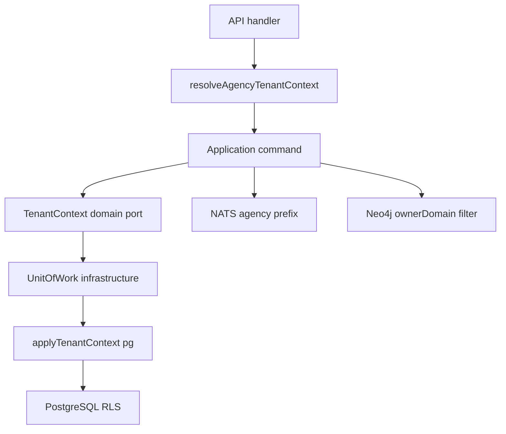

# ADR0007 — Estratégia multi-tenancy (Agency = tenant container)

## Status

**Accepted** — implementado em ANX-256 (RLS), ANX-257 (NATS prefix), ANX-258 (Neo4j ownerDomain), ANX-259 (API bootstrap + Pattern B UoW). Documentação detalhada em [spec 008](../specs/008-multi-tenant-isolation/spec.md).

> **Nota de numeração:** ADR0006 permanece reservado a [gateways externos](./0006-distribute-external-gateways-within-baseline.md). Esta decisão de multi-tenancy ocupa **ADR0007**.

## Contexto

anxionOS é multi-tenant: cada Agency opera com capital, grants, memberships e dados isolados. O [spec 001](../specs/001-institutional-contract/spec.md) descreve Organization como agrupamento de empresas do mesmo titular, **sem compartilhamento implícito de contas** entre titulares, e registra tenant dedicado como opção operacional via adapter mantendo o mesmo contrato.

Precisamos de um boundary único e auditável que:

1. Propague para PostgreSQL RLS (`app.tenant_id`, `app.agency_id`)
2. Isole assinaturas NATS JetStream por agência
3. Marque projeções Neo4j com `ownerDomain` do módulo dono e escopo de agência no payload
4. Respeite [ADR0002](./0002-adopt-modular-backend-layout.md) — camada `application` não importa `@anxionos/database`

Até existir tenant de plataforma (operador SaaS acima de múltiplas agencies), **Agency = tenant**.

## Decisão

### Pattern B — tenantId = agencyId

1. **`tenantId` = `agencyId`** em todo contexto de request/job/worker até introdução de platform-tenant.
2. **`TenantContext`** é port de domínio (`domain/ports/tenant-context.ts` em `organizations` e `governance`); infraestrutura adapta via `applyTenantContext` do pacote `@anxionos/database`.
3. **UoW explícito:** comandos passam `TenantContext` para `runInTransaction`; queries usam guards de escopo (`assertAgencyScope`, membership guards).
4. **Organization** permanece agrupamento lógico (spec 001); **não** é unidade de isolamento RLS/NATS nesta fase.

### PostgreSQL RLS

Session vars: `app.tenant_id`, `app.agency_id`, `app.bypass_rls`.

| Tabela | Módulo | RLS ativo |
| --- | --- | --- |
| `organizations_agencies` | organizations | sim |
| `organizations_owners` | organizations | sim |
| `organizations_memberships` | organizations | sim |
| `governance_grants` | governance | sim |
| `governance_change_proposals` | governance | sim |
| `governance_approvals` | governance | sim |
| `governance_authority_epochs` | governance | sim |
| `anxionos_tenant_records` | database (fixture test) | sim |

Políticas usam `current_setting('app.tenant_id')` (e `app.agency_id` quando coluna presente). Pool `anxion_app` **rejeita** `bypassRls`; bypass somente via role `anxion_service` com `app.bypass_rls=true`.

Journals (`organizations_command_journal`, `governance_command_journal`) e tabelas `governance_delegations` / `governance_mandates` possuem colunas de escopo; políticas RLS completas são follow-up rastreado na spec 008.

### NATS JetStream

Subject agency-scoped:

```text
agency.{agencyId}.events.{eventType}
```

Fallback platform-scoped (sem agencyId): `events.{eventType}`.

Stream `EVENTS` subjects: `events.>`, `agency.>.events.>`.

Implementação: `resolveEventSubject` em `backend/packages/eventing/src/nats-publisher.ts`.

### Neo4j / Graph Kernel

- Eventos de domínio carregam `ownerDomain` do módulo dono (ex.: `organizations`, `governance`, `identity`).
- Projeções agency-scoped propagam `agencyId` no payload do evento; consumidores filtram por `ownerDomain` + escopo de agência.
- Product/Agent graph (`ownerDomain: product|agents`) permanece distinto do grafo institucional runtime — ver ADR0005 product graph quando aplicável.

### API bootstrap (composition root)

`resolveAgencyTenantContext(agencyId, principalId)` em `backend/apps/api/src/middleware/resolve-tenant-context.ts` — único ponto que pode importar tipo canônico de `@anxionos/database`.



## Alternativas consideradas

| Alternativa | Prós | Contras | Decisão |
| --- | --- | --- | --- |
| A. Organization como tenant | Modelo SaaS clássico | Organization ainda não modelada como isolamento; Agency já é unidade operacional | Rejeitada (fase atual) |
| B. Agency = tenant (1:1) | Alinha com RLS/NATS já implementados | Migração futura se platform-tenant surgir | **Aceita** |
| C. TenantContext só em `@anxionos/database` | Um tipo | Viola AR01 — application importaria database | Rejeitada |
| D. Bypass RLS no pool app | Debug fácil | Falha de isolamento | Proibida (RLS-04) |
| E. tenantId separado de agencyId agora | Flexibilidade SaaS | Não observado nos fluxos verificados; complexidade prematura | Adiado |

## Consequências

### Positivas

- Isolamento verificável (RLS-ORG-01/02, RLS-01..04, oráculos G3/G5, fixture `orgs-two-agencies`)
- Boundary AR01 limpo — ports em domain, adapters em infrastructure
- NATS e grafo seguem o mesmo identificador de escopo

### Negativas / riscos

- Renomear tenant quando platform-tenant existir exige migração de políticas e subjects
- `findInvitedByTokenHash` pré-UoW precisa resolver `agencyId` antes do TX (invite cross-lookup)
- Journals e delegations/mandates ainda sem políticas RLS completas

### Mitigações

- Transição futura documentada na [spec 008](../specs/008-multi-tenant-isolation/spec.md)
- Testes de fixture com 2+ agencies (ANX-261)
- Guards de aplicação rejeitam cross-tenant antes de SQL

## Critérios de aceite (implementação)

- [x] Domain port `TenantContext` em organizations e governance
- [x] Zero import `@anxionos/database` na camada application (AR01)
- [x] Fixture `orgs-two-agencies.json` + oráculos G3/G5 (ANX-261)
- [x] `bun test tests/organizations/` + `tests/governance/` + `tests/database/` — verde
- [x] `bunx tsc --noEmit -p apps/api/tsconfig.json` — exit 0
- [ ] Owner G7 aceite formal ANX-262 (documentação)

## Rastreabilidade

- [Spec 001 — contrato institucional](../specs/001-institutional-contract/spec.md) — Organization, tenant dedicado via adapter, Lei 11 Agency isolada
- [Spec 008 — isolamento multi-tenant](../specs/008-multi-tenant-isolation/spec.md)
- [ADR0002](./0002-adopt-modular-backend-layout.md), [ADR0004](./0004-postgresql-timescaledb-pgvector.md), [ADR0006](./0006-distribute-external-gateways-within-baseline.md)
- Código: `backend/packages/database/src/tenant-context.ts`, `backend/packages/eventing/src/nats-publisher.ts`, `backend/modules/organizations/`, `backend/modules/governance/`, `backend/apps/api/src/middleware/resolve-tenant-context.ts`

## Open questions (pós-aceite documental)

- Políticas RLS para `governance_delegations`, `governance_mandates` e command journals
- Modelo persistido completo de Organization quando agrupar múltiplas agencies
- Critérios de introdução de platform-tenant (tenantId ≠ agencyId)
