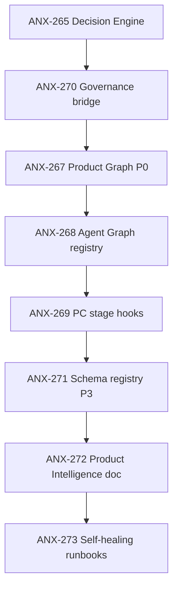
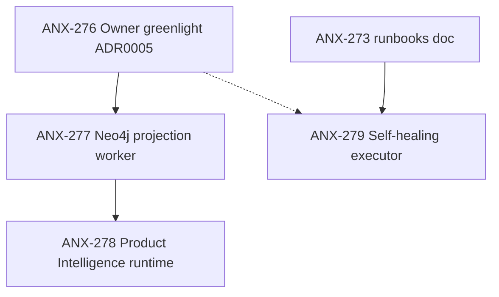

# AI Product Company Engine — plano de execução

## Princípios

1. Documentação aprovada antes de código (P1+ para features novas).
2. Slices incrementais com owner, crítico pareado e gates G0–G7.
3. Nenhum módulo vazio; apenas o que a spec autoriza.
4. Evidência obrigatória: arquivo, issue, teste, revisão, diagrama.

## Fases e dependências

### P0 — Documentação + contratos (COMPLETO 2026-09-10)

**Status:** ANX-265, 267–273, 270 — **done G7**. Contratos: `bun test backend/tests/contracts` 55/55.

### P2 — Runtime sandbox (proposed, requer greenlight Owner)

## Slices P0 (done)

| Issue | Título | Status | Oracle |
| --- | --- | --- | --- |
| ANX-265 | Decision Engine contract | done | bun test contracts 55/55 |
| ANX-270 | Governance bridge | done | authority-grant-bridge.test.ts |
| ANX-267 | Product Graph P0 index | done | brain/product-graph-examples/ |
| ANX-268 | Agent Graph registry | done | 18/18 personas |
| ANX-269 | PC stage hooks | done | product-company-stages 8/8 |
| ANX-271 | Schema registry P3 | done | product-agent-graph-schema 7/7 |
| ANX-272 | Product Intelligence loop | done | brain/notes/anxionos-product-intelligence-loop.md |
| ANX-273 | Self-healing runbooks P1 | done | brain/notes/anxionos-self-healing-runbooks.md |
| ANX-274 | Google Team Playbook | done | google-team-rituals 4/4 |
| ANX-275 | Audit P0 + plano P2 | done | brain/notes/anxionos-ai-product-company-documentation-audit.md |
| ANX-281 | Cognitive OS §21–22–25 | done | experimentation, incidents, self-dev notes |
| ANX-282 | Cognitive OS §19–20–23 | done | performance, learning, arch loop + projection design |
| ANX-283 | P1 doc closure hub | done | brain/notes/anxionos-ai-product-company-index.md |
| ANX-284 | Spec 007 + ANX-277 blueprint | done | spec 007 + projection-worker design |

## Slices P2 (backlog — implementação após greenlight)

### ANX-276 — Owner greenlight ADR0005 + spec 006
| Campo | Valor |
| --- | --- |
| Status | backlog |
| Owner | @Owner + orchestrator |
| Gate | G7 Owner |
| Inputs | ADR0005, spec 006, audit atualizada |
| Outputs | `decision_status: accepted` nos docs |
| Bloqueia | ANX-277 |

### ANX-277 — Neo4j Product Graph projection worker (sandbox)
| Campo | Valor |
| --- | --- |
| Status | backlog |
| Owner | graph-executor + graph-critic |
| Dependência | ANX-276 greenlight, ANX-271 schema |
| Escopo | `backend/modules/graph/` projection worker, inbox, rebuild |
| Critérios | Demo reconstruível sandbox; zero write sem evento |
| Gates | G0→G2→G3 |
| Riscos | Neo4j não homologado prod |

### ANX-278 — Product Intelligence runtime FEEDS_BACK
| Campo | Valor |
| --- | --- |
| Status | backlog |
| Owner | product-executor + product-critic |
| Dependência | ANX-277 |
| Escopo | Telemetria → graph edge → Discovery trigger |
| Critérios | 1 ciclo automático demonstrado sandbox |
| Gates | G3 |

### ANX-279 — Self-healing runbook executor (staging)
| Campo | Valor |
| --- | --- |
| Status | backlog |
| Owner | ops-executor + security-critic |
| Dependência | ANX-273 doc + G4 Isa PASS |
| Escopo | sh-rb-001..003 automation + DecisionRecord |
| Critérios | Simulação staging com rollback |
| Gates | G4 obrigatório |

## Slices históricos (referência)

### ANX-250 — Audit documentação e alinhamento 30→23 módulos
| Campo | Valor |
| --- | --- |
| Status | done (parcial — nota em brain/) |
| Owner | orchestrator |
| Gate | G0 |
| Outputs | `brain/notes/anxionos-product-company-module-alignment.md`, `brain/notes/anxionos-ai-product-company-lifecycle.md` |
| Critérios | Conflitos/lacunas documentados; ADRs aceitos vs propostos classificados |

### ANX-265 — Decision Engine: contrato e schemas (em andamento)
| Campo | Valor |
| --- | --- |
| Status | in_progress |
| Owner | backend-executor + backend-critic |
| Gate atual | G1 |
| Escopo | `backend/packages/contracts/src/decisions/` + testes |
| Inputs | `brain/project-docs/specs/anx-governance-decision-engine/design.md` |
| Outputs | DecisionRecord envelope, decisionScopeSchema, decisionEngineStatusSchema, testes 8/8 |
| Critérios G1 | Crítico PASS; typecheck + testes verdes; sem duplicação governance |
| Riscos | Conflito semântico com status legado — mitigado por schemas separados |
| Bloqueia | ANX-266, ANX-267 |

### ANX-266 — Governance bridge: AuthorityReference ↔ grants
| Campo | Valor |
| --- | --- |
| Status | todo (proposed) |
| Owner | backend-executor + backend-critic |
| Dependência | ANX-265 G1 PASS |
| Escopo | `backend/modules/governance/` + contratos bridge |
| Inputs | design.md § Authority Matrix L0–L6 |
| Outputs | Mapeamento AuthorityReference → Grant sem duplicar ownership |
| Critérios | Testes de contrato; G2 code review; sem efeito financeiro |
| Gates | G0→G1→G2 |

### ANX-267 — Product Graph P0: indexação OKF + issues
| Campo | Valor |
| --- | --- |
| Status | todo (proposed) |
| Owner | docs-executor + docs-critic |
| Dependência | ANX-265 |
| Escopo | `brain/` frontmatter productGraph; CLI proposed |
| Inputs | `brain/project-docs/specs/006-product-agent-graph/spec.md` |
| Outputs | 3 instâncias de exemplo (ANX-135, ANX-265, feature futura) |
| Critérios | Queries P0 executáveis via OKF search + graphify |
| Gates | G0→G1 (doc) |

### ANX-268 — Agent Graph registry: personas → Agent nodes
| Campo | Valor |
| --- | --- |
| Status | todo (proposed) |
| Owner | orchestrator + cto-critic |
| Dependência | ANX-267 |
| Escopo | `.cursor/orchestration/` + brain/ |
| Outputs | Mapeamento PERSONAS.md → AgentRole nodes; coverageStatus |
| Critérios | 100% personas permanentes com coverageStatus |
| Gates | G0→G1 (framework) |

### ANX-269 — Orchestration hooks: product-company stage tracking
| Campo | Valor |
| --- | --- |
| Status | todo (proposed) |
| Owner | framework-executor + framework-critic |
| Dependência | ANX-268 |
| Escopo | `.cursor/orchestration/agent-workflow/` |
| Outputs | `orchestration:phase` integrado com 12 etapas Product Company |
| Critérios | Issue ANX-* reporta etapa atual; testes CLI |
| Gates | G0→G1→G2 |

### ANX-270 — Graph projection schema (P3 proposed)
| Campo | Valor |
| --- | --- |
| Status | todo (proposed) |
| Owner | graph-executor + graph-critic |
| Dependência | ANX-266, ANX-267 |
| Escopo | `backend/modules/graph/` |
| Outputs | Schema registry ProductGraph + AgentGraph nodes |
| Critérios | Projeção reconstruível; ADR P3 |
| Gates | G0→G2 (arquitetura) |
| Riscos | Neo4j não homologado — manter proposed |

### ANX-271 — Product Intelligence loop
| Campo | Valor |
| --- | --- |
| Status | todo (proposed) |
| Owner | product-executor + product-critic |
| Dependência | ANX-270 |
| Escopo | Monitor → FEEDS_BACK → Problem |
| Outputs | Runbook de telemetria; dashboard proposed |
| Critérios | Loop documentado; 1 ciclo manual demonstrado |
| Gates | G0→G3 |

### ANX-272 — Self-healing runbooks P1 (determinístico)
| Campo | Valor |
| --- | --- |
| Status | todo (proposed) |
| Owner | ops-executor + security-critic |
| Dependência | ANX-271 |
| Escopo | brain/runbooks/ + audit trail |
| Outputs | 3 runbooks preautorizados com rollback |
| Critérios | Simulação em sandbox; DecisionRecord quando material |
| Gates | G0→G4 (security) |
| Riscos | Autoelevação — mitigado por whitelist de procedimentos |

## Matriz gate × slice (P0 completo)

| Slice | G7 | Notas |
| --- | --- | --- |
| ANX-265–273, 270 | ✓ done | Doc + contratos P0 |
| ANX-276 | pend Owner | Greenlight ADR0005 |
| ANX-277 | — | G2 arquitetura antes de código |
| ANX-278 | — | G3 após projection worker |
| ANX-279 | — | G4 Isa antes de ativar runbooks |

## Próximas ações imediatas

1. **@Owner** — revisar e aceitar ADR0005 + spec 006 (ANX-276).
2. Após greenlight — claim ANX-277 projection worker sandbox.
3. G4 Security — review runbooks ANX-273 antes de ANX-279.
4. Manter audit em `brain/notes/anxionos-ai-product-company-documentation-audit.md` sincronizada.

## Fora de escopo deste plano

- Módulos Products e Marketplace (gaps — requer spec própria)
- Runtime de agentes autônomos permanentes
- Deploy produção Neo4j
- Self-development sem supervisão