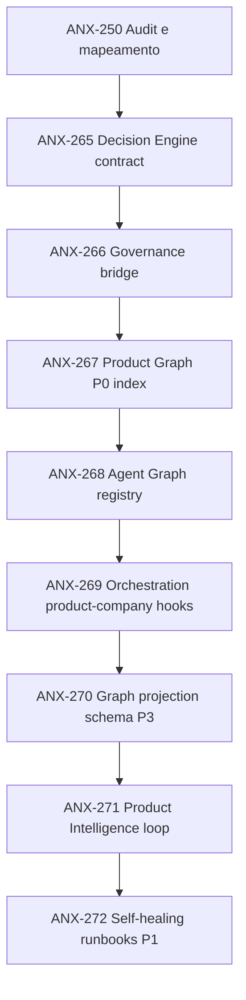

# AI Product Company Engine — plano de execução

## Princípios

1. Documentação aprovada antes de código (P1+ para features novas).
2. Slices incrementais com owner, crítico pareado e gates G0–G7.
3. Nenhum módulo vazio; apenas o que a spec autoriza.
4. Evidência obrigatória: arquivo, issue, teste, revisão, diagrama.

## Fases e dependências

## Slices detalhados

### ANX-250 — Audit documentação e alinhamento 30→23 módulos
| Campo | Valor |
| --- | --- |
| Status | done (parcial — nota em brain/) |
| Owner | orchestrator |
| Gate | G0 |
| Outputs | `brain/notes/anxionos-product-company-module-alignment.md`, `brain/notes/anxionos-ai-product-company-lifecycle.md` |
| Critérios | Conflitos/lacunas documentados; ADRs aceitos vs propostos classificados |

### ANX-265 — Decision Engine: contrato e schemas (em andamento)
| Campo | Valor |
| --- | --- |
| Status | in_progress |
| Owner | backend-executor + backend-critic |
| Gate atual | G1 |
| Escopo | `backend/packages/contracts/src/decisions/` + testes |
| Inputs | `brain/project-docs/specs/anx-governance-decision-engine/design.md` |
| Outputs | DecisionRecord envelope, decisionScopeSchema, decisionEngineStatusSchema, testes 8/8 |
| Critérios G1 | Crítico PASS; typecheck + testes verdes; sem duplicação governance |
| Riscos | Conflito semântico com status legado — mitigado por schemas separados |
| Bloqueia | ANX-266, ANX-267 |

### ANX-266 — Governance bridge: AuthorityReference ↔ grants
| Campo | Valor |
| --- | --- |
| Status | todo (proposed) |
| Owner | backend-executor + backend-critic |
| Dependência | ANX-265 G1 PASS |
| Escopo | `backend/modules/governance/` + contratos bridge |
| Inputs | design.md § Authority Matrix L0–L6 |
| Outputs | Mapeamento AuthorityReference → Grant sem duplicar ownership |
| Critérios | Testes de contrato; G2 code review; sem efeito financeiro |
| Gates | G0→G1→G2 |

### ANX-267 — Product Graph P0: indexação OKF + issues
| Campo | Valor |
| --- | --- |
| Status | todo (proposed) |
| Owner | docs-executor + docs-critic |
| Dependência | ANX-265 |
| Escopo | `brain/` frontmatter productGraph; CLI proposed |
| Inputs | `brain/project-docs/specs/006-product-agent-graph/spec.md` |
| Outputs | 3 instâncias de exemplo (ANX-135, ANX-265, feature futura) |
| Critérios | Queries P0 executáveis via OKF search + graphify |
| Gates | G0→G1 (doc) |

### ANX-268 — Agent Graph registry: personas → Agent nodes
| Campo | Valor |
| --- | --- |
| Status | todo (proposed) |
| Owner | orchestrator + cto-critic |
| Dependência | ANX-267 |
| Escopo | `.cursor/orchestration/` + brain/ |
| Outputs | Mapeamento PERSONAS.md → AgentRole nodes; coverageStatus |
| Critérios | 100% personas permanentes com coverageStatus |
| Gates | G0→G1 (framework) |

### ANX-269 — Orchestration hooks: product-company stage tracking
| Campo | Valor |
| --- | --- |
| Status | todo (proposed) |
| Owner | framework-executor + framework-critic |
| Dependência | ANX-268 |
| Escopo | `.cursor/orchestration/agent-workflow/` |
| Outputs | `orchestration:phase` integrado com 12 etapas Product Company |
| Critérios | Issue ANX-* reporta etapa atual; testes CLI |
| Gates | G0→G1→G2 |

### ANX-270 — Graph projection schema (P3 proposed)
| Campo | Valor |
| --- | --- |
| Status | todo (proposed) |
| Owner | graph-executor + graph-critic |
| Dependência | ANX-266, ANX-267 |
| Escopo | `backend/modules/graph/` |
| Outputs | Schema registry ProductGraph + AgentGraph nodes |
| Critérios | Projeção reconstruível; ADR P3 |
| Gates | G0→G2 (arquitetura) |
| Riscos | Neo4j não homologado — manter proposed |

### ANX-271 — Product Intelligence loop
| Campo | Valor |
| --- | --- |
| Status | todo (proposed) |
| Owner | product-executor + product-critic |
| Dependência | ANX-270 |
| Escopo | Monitor → FEEDS_BACK → Problem |
| Outputs | Runbook de telemetria; dashboard proposed |
| Critérios | Loop documentado; 1 ciclo manual demonstrado |
| Gates | G0→G3 |

### ANX-272 — Self-healing runbooks P1 (determinístico)
| Campo | Valor |
| --- | --- |
| Status | todo (proposed) |
| Owner | ops-executor + security-critic |
| Dependência | ANX-271 |
| Escopo | brain/runbooks/ + audit trail |
| Outputs | 3 runbooks preautorizados com rollback |
| Critérios | Simulação em sandbox; DecisionRecord quando material |
| Gates | G0→G4 (security) |
| Riscos | Autoelevação — mitigado por whitelist de procedimentos |

## Matriz gate × slice

| Slice | G0 | G1 | G2 | G3 | G4 | G5 | G6 | G7 |
| --- | --- | --- | --- | --- | --- | --- | --- | --- |
| ANX-250 | ✓ | — | — | — | — | — | — | Owner |
| ANX-265 | ✓ | em curso | pend | — | — | — | — | — |
| ANX-266 | pend | pend | pend | — | — | — | — | — |
| ANX-267–272 | pend | pend | variável | variável | ANX-272 | — | — | — |

## Próximas ações imediatas

1. Concluir G1 PASS em ANX-265 (contratos decisions).
2. Criar issues ANX-266 a ANX-272 no taskboard com dependências.
3. Validar spec 006-product-agent-graph com exemplos reais.
4. Propor ADR para projeção Neo4j (P3) após ANX-266.

## Fora de escopo deste plano

- Módulos Products e Marketplace (gaps — requer spec própria)
- Runtime de agentes autônomos permanentes
- Deploy produção Neo4j
- Self-development sem supervisão