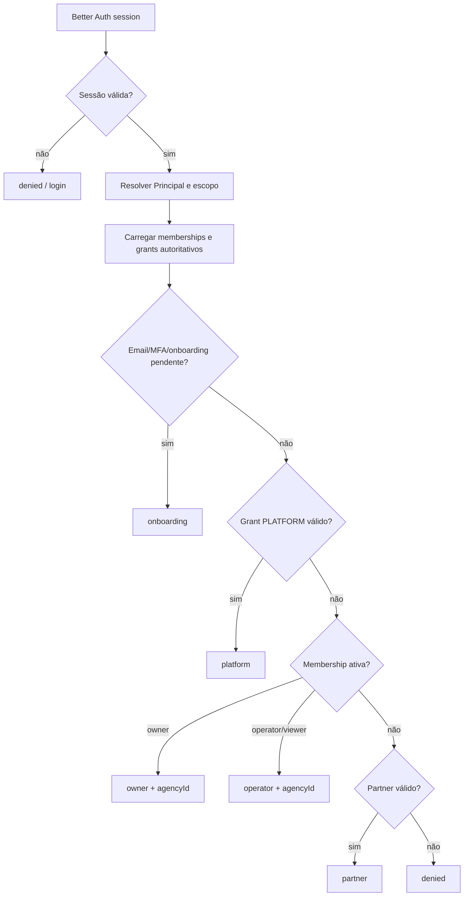

# Post-login Auth Context Contract for Frontend Routing

## Status e decisão arquitetural candidata

**Status: proposed.** Esta é uma proposta de capability/ADR candidata, aguardando aceite do Owner por uma issue `ANX-*` ou pelo processo P0/P1 do Product Company. Não altera código, não reivindica issue e não autoriza produção.

O backend deve expor um loader autenticado, preferencialmente `GET /v1/auth/post-login-context` (nome sujeito a confirmação de API), que calcule o destino pós-login a partir da sessão Better Auth, Principal, memberships e grants autoritativos. O frontend consome o resultado; não replica regras de autorização nem escolhe um dashboard apenas pelo papel declarado no cliente.

A resposta deve ser calculada server-side, com escopo derivado da sessão e leitura consistente das fontes autoritativas. Falha, projeção obsoleta ou contexto incompleto deve ser fail-closed: o frontend não deve presumir acesso.

## Contrato proposto

```ts
interface PostLoginAuthContext {
  authenticated: boolean;
  emailVerified: boolean;
  mfaRequired: boolean;
  principal: {
    id: string;
    authUserId: string;
    email: string;
    displayName?: string | null;
  } | null;
  membershipsActive: Array<{
    agencyId: string;
    role: "owner" | "operator" | "viewer" | string;
    status: "active";
  }>;
  membershipsPending: Array<{
    agencyId?: string;
    role?: "owner" | "operator" | "viewer" | string;
    inviteEmail?: string;
    inviteExpiresAt?: string;
  }>;
  platformAccess: boolean;
  partnerAccess: boolean;
  onboardingState: {
    needsProfile: boolean;
    needsOrganization: boolean;
    needsEmailVerification?: boolean;
    needsMfa?: boolean;
    state?: string;
  };
  decision: {
    kind: "platform" | "owner" | "operator" | "partner" | "onboarding" | "denied";
    agencyId?: string;
    role?: "owner" | "operator" | "viewer" | string;
    reason: string;
  };
  authorization?: {
    policyVersion: string;
    authorityEpoch?: number;
    generatedAt: string;
    expiresAt?: string;
  };
}
```

`principal` é `null` quando `authenticated` é `false`; os demais campos devem ter valores seguros e coerentes para o estado não autenticado. `membershipsActive` inclui somente memberships `active`. Convites expirados ou revogados não devem virar acesso pendente acionável. `platformAccess` exige grant explícito PLATFORM; título, email ou membership de agência não o inferem. `partnerAccess` exige vínculo/grant do domínio de partners; não deve ser inferido de referral textual.

`decision` é autoritativa para o redirecionamento inicial. O frontend pode renderizar loading, erro ou tela de acesso negado, mas não deve substituir `decision.kind` por heurística local. Quando houver múltiplas memberships, a resposta pode escolher a agência inicial segundo política versionada; o frontend deve permitir trocar de agência por uma operação posterior autorizada.

## Regras de decisão mínimas

1. Sessão ausente ou inválida: `authenticated: false`, `decision.kind: "denied"` e `reason` seguro.
2. Sessão válida mas email/MFA obrigatório: `decision.kind: "onboarding"`, com flags específicas; não conceder dashboard.
3. Grant PLATFORM explícito e válido: `platform` prevalece para o destino inicial.
4. Membership ativa `owner`: `owner` com `agencyId` e role.
5. Membership ativa operacional: `operator` com `agencyId` e role.
6. Vínculo partner válido sem destino platform/agency prioritário: `partner`.
7. Nenhum acesso, mas perfil/organização faltante: `onboarding`.
8. Nenhum caminho permitido: `denied`.

A precedência exata deve ser versionada e testada; a lista acima é uma proposta, não um aceite da política comercial. `reason` deve ser um reason code estável ou texto auditável sem expor segredos, tokens, existência de recursos privados ou detalhes internos desnecessários.

## Segurança e consistência

- Autenticar pela sessão Better Auth; nunca aceitar `principalId`, `agencyId`, role ou grant como autoridade no request.
- Consultar Identity/Governance/Organizations/Partners por ports e contratos públicos, mantendo ownership modular conforme ADR0002.
- Comparar epochs/revisões autoritativas quando o contexto fundamentar uma permissão sensível; uma projeção stale pode informar UI, mas não pode produzir `platformAccess` ou `decision` permissivo.
- Não incluir tokens de convite, hashes, segredos, claims não filtradas ou dados de outras agências.
- Responder com envelope de erro versionado e `correlationId`; não vazar se uma agência privada existe.
- Evitar cache compartilhado sem vínculo ao principal, sessão, escopo e versão de autoridade.
- O endpoint é um mapa de roteamento, não substitui autorização em cada endpoint subsequente.

## Evidência analisada

- `backend/apps/api/src/auth/create-better-auth.ts`: Better Auth usa `emailAndPassword`, adapter Drizzle/PostgreSQL e hooks de banco; a configuração atual não expõe este contexto composto.
- `backend/apps/api/src/auth/identity-better-auth-hooks.ts`: criação/atualização Better Auth registra e sincroniza Principal via Identity; é a ponte existente entre usuário de autenticação e identidade institucional.
- `backend/apps/api/src/organizations/plugin.ts`: plugin resolve sessão Better Auth, resolve Principal e protege rotas por membership; lista agências/memberships e aceita convites, mas não oferece loader pós-login unificado.
- `backend/modules/organizations/src/domain/entities/membership.ts`: membership carrega `tenantId`, `agencyId`, `principalId`, convite, expiração, role e status; transições válidas são invited→active/revoked e active→revoked; há invariantes de owner ativo.
- O código de `grant.ts` solicitado não foi encontrado no caminho indicado durante a inspeção; grants devem ser tratados como contrato de domínio a confirmar no módulo proprietário, sem inventar estrutura.
- Graphify query (`authentication Better Auth organizations memberships post-login authorization routing`) encontrou os nós de Better Auth/session, `organizations/src/index.ts`, persistence de memberships e plugin de organizações; também revelou resultados vendor não relacionados, portanto a consulta não foi usada como prova exclusiva.
- ANX-118 registra que memberships/grants pertencem a Identity/Governance, com PostgreSQL como autoridade e grafo/read models como projeções; também alerta para desvios application→infra e para não declarar aderência integral.
- ADR0002 confirma apps como composition roots, modules como donos de estado/casos de uso e contratos públicos entre módulos.
- SDD institucional v1 exige permissões por identidade/escopo, grants explícitos, separação PLATFORM/AGENCY e revalidação autoritativa; o módulo partners é planejado e deve ser verificado antes de afirmar `partnerAccess`.
- Personas do time definem Owner, operador e partner como superfícies distintas e exigem evidência de autorização, não inferência por texto de chat.

## Endpoint/loader e evolução

A implementação futura deve escolher entre endpoint HTTP e loader interno de composition root sem mudar o contrato semântico. Recomenda-se endpoint versionado para permitir Astro/React islands e outros consoles consumirem a mesma decisão. O contrato deve receber testes de contrato, unitários para a matriz de precedência, integração com PostgreSQL e sessão real, e E2E para sessão anônima, email não verificado, MFA, owner, operator, platform, partner, convite pendente/expirado e ausência total de acesso.

A resposta deve incluir `policyVersion`/`authorityEpoch` quando disponível, para diagnóstico e revalidação. Mudanças no conjunto de `kind`, roles ou reason codes exigem versionamento compatível e atualização do router frontend; não adicionar um papel silenciosamente.

## Desbloqueio do frontend

Este contrato desbloqueia o trabalho do frontend login router sem aguardar as capacidades bloqueadas `ANX-143`/`ANX-153`. Ele não elimina a necessidade de vincular a proposta a uma issue `ANX-*`, obter aceite do Owner e implementar/revisar o endpoint e o router em fases posteriores. A próxima ação é criar ou selecionar a issue de implementação (possivelmente `ANX-164` como dependência), anexar este documento como contexto e somente então reivindicar o trabalho.

## Questões abertas para aceite

- Qual é a fonte autoritativa e o schema do grant PLATFORM?
- O vínculo partner já possui módulo/contrato implementado ou deve retornar `false` até existir evidência?
- Qual política versionada resolve múltiplas memberships ativas?
- MFA e verificação de email são flags Better Auth, Identity ou Governance?
- `viewer` deve redirecionar para `operator` com capacidade reduzida ou ter `kind` próprio?
- Quais reason codes são públicos ao frontend e quais ficam apenas no log de auditoria?

## Fluxo proposto


