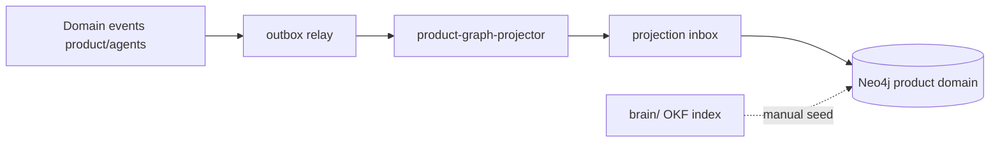

# Product Graph projection worker — design P2

**Issue:** ANX-277 · **Bloqueio:** ANX-276 Owner greenlight · **ADR:** 0005 proposed

## Objetivo

Projetar nós/arestas Product+Agent Graph em Neo4j **read-only**, reconstruível a partir de eventos com `eventId`, `checkpoint`, `ownerDomain`.

## Reuso do módulo graph existente

| Componente existente | Uso ANX-277 |
| --- | --- |
| `projection-consumer.ts` | Padrão inbox idempotency |
| `process-with-inbox.ts` | ACK após COMMIT |
| `createProductAgentGraphSchemaRegistry()` | Allowlist nodes/edges |
| `graph-store-adapter.ts` (Neo4j) | Writer read-model |
| `rebuild-worker.ts` | Full generation swap |

## Novo (escopo ANX-277)



### Projector `product-graph-projector`

- `ownerDomain`: `product` | `agents`
- Eventos mapeados (v1):
  - `WorkItemStatusChanged` → WorkItem node + TRACKED_IN
  - `DecisionRecorded` → Decision node + APPROVED edge
  - `FeatureDelivered` → Feature + IMPLEMENTS (manual/event futuro)

### Constraints Neo4j

- Labels prefixados: `ProductGraph_*`, `AgentGraph_*`
- Separado de labels institucionais (`Agency`, `Grant`, …)
- Tombstone events — sem DELETE silencioso

## Não escopo ANX-277

- Produção Neo4j homologada
- Pipeline OKF→Neo4j automático (issue futura)
- Escrita direta por agentes

## Critérios aceite implementação

- [ ] Sandbox Neo4j up via docker profile
- [ ] 1 evento → 1 nó projetado idempotente
- [ ] Rebuild from inbox passa
- [ ] `bun test` graph module green
- [ ] G2 arquitetura PASS

## Blueprint de arquivos (espelha governance)

| Arquivo novo | Referência existente |
| --- | --- |
| `backend/modules/graph/src/domain/projections/constants.ts` | Adicionar `GRAPH_PRODUCT_CONSUMER_NAME`, `GRAPH_AGENTS_CONSUMER_NAME` |
| `backend/modules/graph/src/application/projections/product/product-graph-projector.ts` | `governance-projector.ts` |
| `backend/modules/graph/src/application/projections/agents/agent-graph-projector.ts` | `organizations-projector.ts` |
| `backend/apps/workers/src/graph/product-graph-projection-worker.ts` | `governance-projection-worker.ts` |
| `backend/apps/workers/src/bootstrap.ts` | Registrar worker sandbox profile |
| `backend/tests/graph/product-graph-projector.test.ts` | `governance-projector.test.ts` |
| `backend/tests/graph/product-graph-projection-worker.test.ts` | integração inbox idempotency |

### Constantes propostas

```typescript
export const GRAPH_PRODUCT_CONSUMER_NAME = "graph:product:v1";
export const GRAPH_AGENTS_CONSUMER_NAME = "graph:agents:v1";
```

### Export público

- `productProjectionConsumer` + `agentProjectionConsumer` em `@anxionos/graph` index
- `createProductAgentGraphSchemaRegistry()` já exportado (ANX-271)

### Eventos v1 (contratos a criar em ANX-277)

| Evento | ownerDomain | Nó projetado |
| --- | --- | --- |
| `work_item.status_changed` | product | WorkItem + TRACKED_IN |
| `decision.recorded` | product | Decision + APPROVED |
| `agent.role_assigned` | agents | AgentRole + ASSIGNED_TO |

Schemas Zod em `backend/packages/contracts/src/graph/events/` (novo pacote).

### Sandbox profile

- `ENABLE_PRODUCT_GRAPH_PROJECTION=true` em `backend/.env.example`
- Neo4j via docker compose profile `graph-sandbox`
- Worker **não** inicia em produção sem ADR0005 accepted + G4 Isa

## Dependências

1. ANX-276 greenlight
2. ADR0005 `decision_status: accepted`
3. Schema registry ANX-271 (done)
