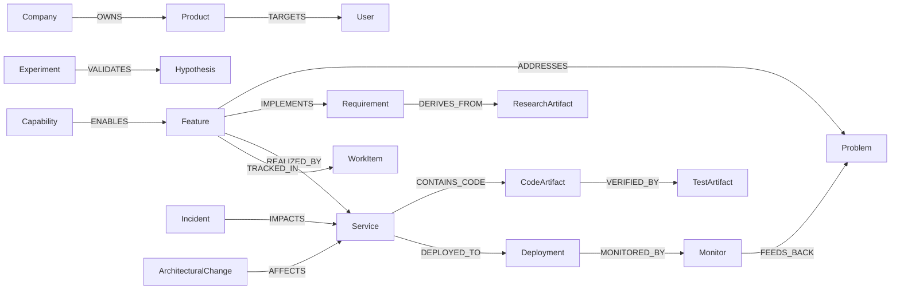
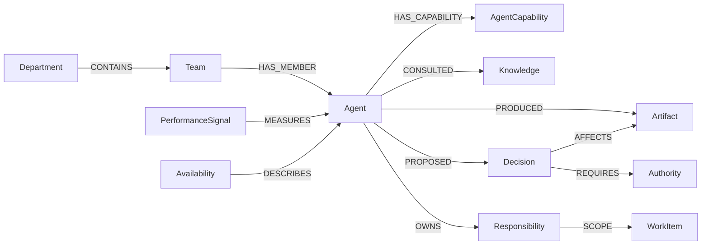

# Product Graph e Agent Graph — sistema operacional cognitivo

## Status e escopo

Esta spec é **proposta**. Descreve o modelo cognitivo da AI Product Company Engine sem afirmar implementação runtime completa. Persistência autoritativa em P0 = OKF (`brain/`) + issues `ANX-*`; projeção Neo4j = P3 (proposed). Não substitui o grafo institucional de runtime (`backend/modules/graph/`).

Fontes relacionadas:
- `.cursor/orchestration/PRODUCT-GRAPH-SCHEMA.md` — schema lógico P0
- `.cursor/orchestration/PRODUCT-COMPANY-MODEL.md` — 12 etapas operacionais
- `brain/notes/anxionos-product-company-module-alignment.md` — alinhamento 30→23 módulos
- `brain/project-docs/specs/anx-governance-decision-engine/design.md` — Decision Engine

## Visão

O Product Graph e o Agent Graph formam o **sistema operacional cognitivo** da empresa de produto virtual:

- **Product Graph** — memória organizacional de produto: problemas, requisitos, features, capabilities, código, testes, deploys e sinais.
- **Agent Graph** — memória organizacional de agentes: departamentos, equipes, capabilities, conhecimento, decisões, autoridade, artefatos e desempenho.

Ambos são **projeções explicáveis** sobre eventos versionados com `eventId`, `checkpoint` e `ownerDomain`. Nenhum grafo é ledger autoritativo de capital, grants ou ordens.

## Product Graph — entidades

| Entidade | Descrição | Owner típico |
| --- | --- | --- |
| Company | Organização virtual (plataforma ou tenant) | governance |
| Product | Linha ou produto | product (conceitual) |
| Problem | Dor ou oportunidade validada | discovery |
| User | Persona JTBD (humano, não agente Cursor) | product |
| Requirement | Requisito rastreável SHALL | specs OKF |
| Feature | Unidade entregável | product |
| Capability | Capacidade institucional (specs 001–005) | módulo dono |
| Service | Serviço deployável / módulo backend | módulo dono |
| CodeArtifact | Arquivo, símbolo ou pacote | git/graphify |
| TestArtifact | Teste com oracle verificável | módulo dono |
| Deployment | Release em ambiente | release/ops |
| Monitor | Sinal operacional ou KPI | observability |
| WorkItem | Issue Dashi ANX-* | taskboard |
| ResearchArtifact | Nota/spike em brain/ | OKF |
| Experiment | Hipótese A/B ou feature flag governada | product-intelligence |
| Incident | Evento operacional com impacto | ops/SRE |
| ArchitecturalChange | ADR ou mudança estrutural | architecture |

### Relações principais (Product Graph)



## Agent Graph — entidades

| Entidade | Descrição | Owner típico |
| --- | --- | --- |
| Agent | Persona IA ou humano com identidade verificável | orchestration |
| Department | Domínio organizacional (Strategy, Engineering, QA…) | orchestration |
| Team | Par executor-crítico ou gate lead | orchestration |
| AgentCapability | O que o agente pode fazer (não confundir com Capability de produto) | orchestration |
| Knowledge | Artefato em brain/ ou Supermemory com proveniência | agents/knowledge |
| Decision | Registro de decisão (envelope DecisionRecord) | decisions |
| Authority | Grant, mandate ou nível L0–L6 | governance |
| Artifact | Output produzido (spec, código, review, deploy) | audit |
| PerformanceSignal | Métrica de throughput, qualidade, latência de gate | product-intelligence |
| Availability | Estado de sessão/presença do agente | orchestration |
| Responsibility | Ownership de WorkItem, Feature ou Service | governance |

### Relações principais (Agent Graph)



## Bridge Product ↔ Agent

| Ligação | Significado |
| --- | --- |
| WorkItem → OWNED_BY_AGENT → Agent | Issue claimada com persona |
| Feature → DECIDED_BY → Decision | Feature aprovada por decisão rastreável |
| Decision → AFFECTS → CodeArtifact | Blast radius de mudança |
| Knowledge → SUPPORTS → Requirement | Evidência de spec |
| PerformanceSignal → FEEDS_BACK → Problem | Loop Product Intelligence |
| Authority → GOVERNS → Deployment | Release requer grant |

## Capabilities, autoridade e decisões

- **Capabilities de produto** mapeiam para módulos do baseline (23) via `ownerModule`.
- **Capabilities de agente** mapeiam para slugs em `PERSONAS.md` e `AGENT-ROSTER.md`.
- **Autoridade** permanece em `governance` (grants, mandates, approvals L0–L6).
- **Decisões** permanecem em `decisions` (DecisionRecord envelope, intents, permits).
- **Audit** registra linhagem e replay; **graph** projeta nós/arestas reconstruíveis.

Nenhum agente adquire autoridade por inferência do grafo. Elevação exige grant explícito + pipeline G0–G7.

## Conhecimento, aprendizagem e experimentação

| Conceito | P0 (atual) | P1+ (proposed) |
| --- | --- | --- |
| Conhecimento institucional | OKF `brain/` via open-knowledge MCP | Indexação automática em Agent Graph |
| Aprendizagem | `orchestration:brain reflect` + lições em brain/ | Product Intelligence com telemetria agregada |
| Experimentação | Issues + feature flags documentadas | Módulo experiments (proposed) com A/B governado |
| Incidentes | Postmortems OKF + issues blocked | Projeção Incident→Service no grafo |

## Self-healing e self-development

**Proibido** sem aprovação explícita e pipeline completo:

- Autoelevação de autoridade
- Bypass de gates G0–G7
- Efeito financeiro ou operacional não autorizado
- Alteração silenciosa de fatos históricos

**Self-healing permitido (P1 proposed, determinístico):**
- Procedimentos preautorizados e reversíveis (rollback, retry, circuit breaker)
- Escopo limitado a runbooks documentados em brain/
- Registro obrigatório em audit + DecisionRecord quando material

**Self-development permitido (P2+ proposed):**
- Proposta → simulação → revisão independente → aprovação → implementação → G0–G7
- Nunca merge automático sem crítico pareado e gates

## Queries canônicas

### Impacto de produto
```text
Feature → REALIZED_BY → Service → CONTAINS_CODE → CodeArtifact*
  → DEPENDS_ON* → Service|Feature*
  → VERIFIED_BY → TestArtifact*
  → DEPLOYED_TO → Deployment*
  → MONITORED_BY → Monitor*
```

### Responsabilidade de agente
```text
WorkItem ANX-N → OWNED_BY_AGENT → Agent
  → HAS_CAPABILITY → AgentCapability*
  → Team → Department
  → PROPOSED → Decision* → REQUIRES → Authority
```

### Por que esta feature existe?
```text
Feature → ADDRESSES → Problem
  → IMPLEMENTS → Requirement → DERIVES_FROM → ResearchArtifact
  → TRACKED_IN → WorkItem (comentários G0)
```

## Indexação P0 (sem Neo4j)

| Fonte | Grafo |
| --- | --- |
| `brain/project-docs/specs/*.md` | Requirement, Capability |
| Issues `ANX-*` | WorkItem |
| Git / graphify | CodeArtifact, DEPENDS_ON |
| Test paths | TestArtifact |
| `.cursor/orchestration/PERSONAS.md` | Agent, AgentCapability |
| Dialogue / broadcast | Decision trail |

## Invariantes

1. Todo nó tem `id` estável e `ownerDomain`.
2. Arestas são tipadas; deleção = evento, não remoção silenciosa.
3. Nó ligado a código referencia path/símbolo verificável.
4. WorkItem não substitui Requirement/Feature.
5. Product Graph ≠ grafo institucional de runtime (Neo4j P3).
6. Agent Graph ≠ roster estático; inclui performance e disponibilidade.
7. Decisões de produto e engenharia usam `decisionScopeSchema` (product|engineering).

## Critérios de aceite (spec)

- [ ] Schema lógico validado contra exemplos reais (ANX-135, ANX-265)
- [ ] Bridge documentada para módulos graph, decisions, governance, audit
- [ ] Queries de exemplo executáveis em P0 (OKF search + graphify)
- [ ] ADR proposta para projeção Neo4j (P3)
- [ ] Issues ANX-* decompostas para implementação incremental

## Schema registry P3 (ANX-271)

Contratos TypeScript implementados:

- `backend/packages/contracts/src/graph/schema/product-graph-schema.ts` — 15 node types, 16 edge types (`ownerDomain: product`)
- `backend/packages/contracts/src/graph/schema/agent-graph-schema.ts` — 9 node types, 15 edge types (`ownerDomain: agents`)
- `backend/modules/graph/src/domain/schema/product-agent-schema-registry.ts` — factories `createProductGraphSchemaRegistry`, `createAgentGraphSchemaRegistry`, `createProductAgentGraphSchemaRegistry`

**Bridge cross-graph:** aresta `BRIDGES_PRODUCT_ROLE` (`AgentRoleTaxonomy` → `AgentRole`).

**Oráculo:** `bun test backend/tests/contracts/product-agent-graph-schema.test.ts` — 7/7 pass

**ADR:** `brain/project-docs/decisions/0005-product-graph-neo4j-projection.md` (proposed) — projeção Neo4j runtime permanece P3; registry é pré-requisito reconstruível.

## Fora de escopo desta spec

- Implementação de módulos Products ou Marketplace (gaps documentados)
- Runtime de agentes permanentes autônomos
- Autoaprendizagem sem supervisão humana
- Deploy em produção do grafo Neo4j