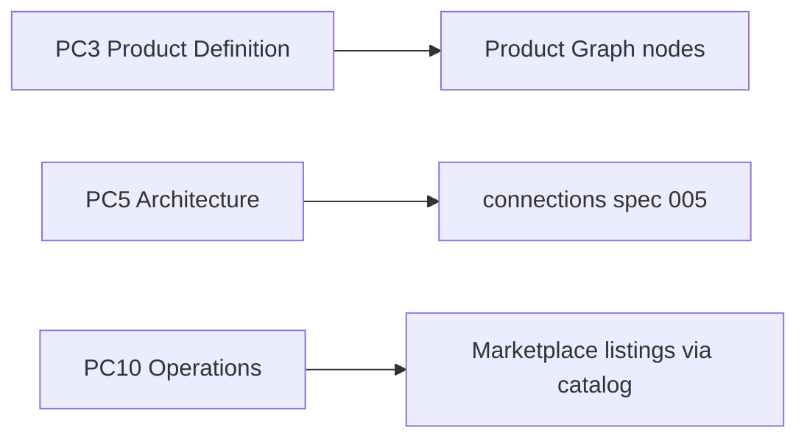

# Products e Marketplace — capacidade composta

> **Legado isolado (ANX-455).** Não há spec 007 em `brain/`. Este arquivo **não prevalece** sobre o baseline ADR0002 nem sobre specs canônicas numeradas. Registro: [docs/document-precedence.md](../../../docs/document-precedence.md).

**Issue:** ANX-284 · **Auditoria:** `brain/notes/anxionos-ai-product-company-documentation-audit.md` §lacunas

## Problema

A taxonomia AI Product Company lista **Products** e **Marketplace** como módulos conceituais. O baseline ADR0002 define **23 módulos físicos** — não há `backend/modules/products/` nem `backend/modules/marketplace/`.

## Decisão proposta

| Conceito | Owner físico | Capacidade |
| --- | --- | --- |
| **Products** | Product Graph (nós `Product`, `Feature`, `Requirement`, `Capability`) + `orchestration` (PC1–PC6) | Definição, roadmap, priorização |
| **Marketplace** | `connections` + `adapter-gateway` + `catalog` (quando P09) | Integrações, listings, bindings externos |

**Proibido:** scaffold de módulo físico sem novo ADR aceito.

## Entidades Product Graph (Products)

Nós já no schema registry ANX-271:

- `Product`, `Feature`, `Requirement`, `Capability`, `Problem`, `UserPersona`
- Relações: `IMPLEMENTS`, `TRACKED_IN`, `DEPENDS_ON`

## Entidades Marketplace (composite)

| Capacidade | Módulo dono | Evidência |
| --- | --- | --- |
| Binding de integração | `connections` | spec 005 |
| Adapter runtime | `adapter-gateway` | ADR0002 árvore |
| Catálogo de ofertas | `catalog` | P09 planejado |
| Projeção grafo | `graph` | nós `Integration`, `Connection` (futuro) |

## Ciclo PC aplicável

## Critérios de aceite (documentação)

- [x] Mapeamento 30→23 em `brain/notes/anxionos-product-company-module-alignment.md`
- [x] Esta spec 007 publicada
- [ ] Owner aceite em ANX-276 (pacote greenlight)

## Riscos

| Risco | Mitigação |
| --- | --- |
| Confusão módulo vs capacidade | Spec 007 + alignment note |
| Marketplace antes de catalog P09 | Documentar como planejado, não implementar |
