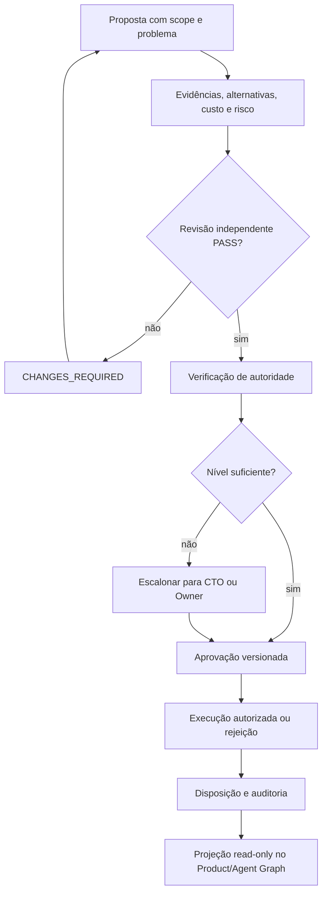
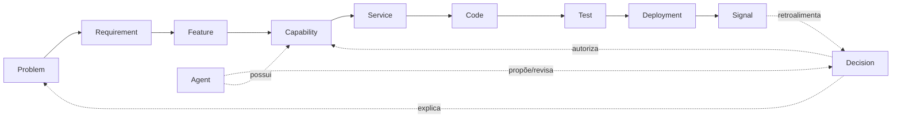

# Governance Contract + Decision Engine

> **Legado (ANX-455).** Design sem número 00N em colisão. Canônico quando existir: `brain/project-docs/specs/anx-governance-decision-engine/`. Registro: [docs/document-precedence.md](../../../docs/document-precedence.md).

## Objetivo

Definir o contrato do Decision Engine do anxionOS/ArcheonOS para dois contextos separados por `scope`:

- `product`: decisões operacionais, financeiras, de risco, grants, migrações e deploys;
- `engineering`: ADRs, planejamento, priorização, hires, gates e mudanças da equipe de produto.

O engine registra e governa decisões; não substitui os módulos proprietários, não executa efeitos financeiros e não concede autoridade por si só.

## Ownership e precedência

- `governance` é dono de grants, mandatos, autoridade e aprovações.
- `decisions` é dono de DecisionRecord, propostas, intenções e disposições.
- `audit` é dono de evidências, linhagem e replay.
- `graph` mantém projeções operacionais e traversals; não vira escritor de fatos de outros módulos.
- PostgreSQL é autoritativo para transações, journal e outbox; Neo4j é projeção do grafo.
- ADRs aceitos prevalecem sobre propostas. ADR0002 e ADR0004 são baseline aceito; decisões de multi-tenancy ainda devem respeitar o estado de ADR0007.

## Modelo de decisão

Uma decisão contém `decisionId`, `scope`, `status`, `title`, `problemStatement`, `proposer`, `evidence`, `alternatives`, `expectedOutcome`, `risk`, `cost`, `confidence`, `affectedEntities`, `requiredAuthority`, `approvals`, `execution` e referências de auditoria. Cada proposta é imutável por versão; correções criam nova versão.

Estados permitidos: `proposed`, `under_review`, `approved`, `rejected`, `executed`, `expired` e `withdrawn`. Toda transição registra origem, destino, ator, horário, versão, issue e evidência.

## Autoridade L0–L6

| Nível | Papel | Poder | Limite |
| --- | --- | --- | --- |
| L0 | Worker | executar tarefa autorizada | não aprova política nem amplia escopo |
| L1 | Specialist | decidir dentro da especialidade | não ultrapassa mandato |
| L2 | Manager | coordenar agentes e slice | não aprova exceções executivas |
| L3 | Director | coordenar departamento | não substitui autoridade executiva |
| L4 | Executive | CTO/CPO/CFO/COO | responde à governança superior |
| L5 | CEO/Owner | greenlight, veto e exceções | autoridade humana final |
| L6 | Engine | impor invariantes e registrar | nunca se autoautoriza |

A nomenclatura não altera os níveis de autonomia já aceitos no produto. Uma decisão de alto risco, conflito com ADR aceito, impacto multi-tenant ou efeito externo exige autoridade executiva e, quando aplicável, escalonamento ao Owner.

## Invariantes

1. Nenhuma aprovação sem evidência rastreável: comando e resultado, arquivo existente, issue ou artefato verificável.
2. `scope` deve corresponder ao domínio e à issue claimada; não há mistura silenciosa entre boards.
3. A autoridade exigida é calculada antes da execução e revalidada com epochs/revisões atuais.
4. Aprovação é vinculada à versão da proposta, ao hash das evidências e às condições explícitas.
5. Decisão expirada ou retirada não pode produzir novo efeito.
6. Cada alteração relevante gera journal/outbox atômicos no módulo proprietário.
7. Segredos nunca entram em decisão, evento, prompt ou grafo.
8. Product Graph e Agent Graph recebem projeções/eventos; não escrevem ledger, grants ou capital.
9. `done` exige G1–G7 concluídos e zero ressalvas; `in_review` não significa aprovado.
10. Nenhum agente pode elevar sua própria autoridade ou aprovar sua própria revisão independente.

## Relação com o Product Graph e Agent Graph

O Product Graph responde por que algo existe e conecta problema, requisito e artefatos. O Agent Graph conecta agente, departamento, capability, autoridade, conhecimento, performance, dependências e responsabilidade. Conhecimento, decisões, incidentes, experimentos e aprendizagem são evidências relacionadas, não autoridade implícita.

## Ciclo de aprovação

1. Proposer cria a decisão e uma proposta versionada.
2. Crítico independente verifica contrato, escopo, risco, autoridade e evidências.
3. Revisores especializados analisam arquitetura, segurança, qualidade e impacto conforme o escopo.
4. Autoridade mínima aprova, rejeita ou escala.
5. Execução ocorre somente com permit versionado, expiração e condições satisfeitas.
6. Resultado gera disposição, auditoria, sinais operacionais e projeção read-only.
7. Falhas, incidentes e feedback podem originar nova proposta; não alteram decisões históricas.

## Decomposição inicial rastreável

| Slice | Owner | Entrada | Saída | Gate |
| --- | --- | --- | --- | --- |
| contrato e schemas | decisions + governance | esta spec, ADRs aceitos | contratos versionados e invariantes | G0–G2 |
| autoridade e aprovação | governance | grants, mandates, policies | matriz e transições verificáveis | G0–G4 |
| journal, outbox e projeção | decisions + audit + graph | eventos versionados | replay e projeção reconstruível | G0–G5 |
| integração de engineering scope | orchestration | taskboard, dialogue, G0–G7 | decisões de slice rastreáveis | G0–G6 |
| operação e aprendizagem | operations + evaluation | outcomes, incidentes e sinais | feedback sem autoelevação | G0–G7 |

Cada slice deve ter uma issue `ANX-*`, owner, crítico independente, dependências, critérios de aceite, testes e pacote de evidências. Nenhum código é autorizado por esta especificação isoladamente.

## Critérios de aceite documental

- separação explícita entre `governance`, `decisions`, `audit` e `graph`;
- `scope: product|engineering` definido sem duplicar ownership;
- autoridade L0–L6 e escalonamento documentados;
- invariantes de evidência, idempotência, expiração, auditoria e isolamento registradas;
- diagramas Mermaid válidos;
- alinhamento com ADR0002, ADR0004, Product Company Model e pipeline G0–G7;
- lacunas de implementação permanecem marcadas como não verificadas, sem promessas de runtime.

## Próxima decisão

Após revisão documental e criação de issue `ANX-*`, o Owner ou autoridade delegada decide se o primeiro slice de implementação será o contrato `decisions` ou a matriz de autoridade `governance`. A implementação só começa com issue claimada, sessão, ack, crítico pareado e compliance pré-work aprovado.