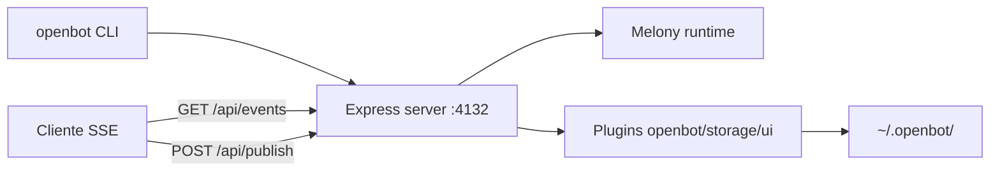
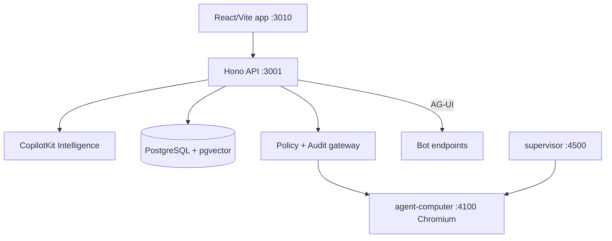

# OpenBot — engenharia reversa comparativa

**Issue:** ANX-124 · **Escopo:** pesquisa autorizada — sem implementação de produto nem instalação global.

## Resumo executivo

Existem **dois projetos distintos** que usam o nome **OpenBot**. Não compartilham código, ownership nem roadmap. O homônimo é a principal fonte de confusão em integrações e documentação.

| Dimensão | meetopenbot/openbot | CopilotKit/openbot |
| --- | --- | --- |
| **Identidade** | Harness local-first independente ("OS for Agents") | Template enterprise de AI coworkers da CopilotKit |
| **Org GitHub** | `meetopenbot` | `CopilotKit` |
| **Criado** | 2026-01-29 | 2026-08-17 |
| **Último push (verificado)** | 2026-07-07 | 2026-09-10 |
| **Licença** | MIT (até v0.5.3; README declara arquivo após essa release) | MIT |
| **Distribuição** | npm global `openbot` | Monorepo privado — clone, não pacote público |
| **Runtime default** | Node ≥20.12, Express, Melony | Bun 1.3+, Docker Compose, Hono server |
| **Relação com CopilotKit** | Nenhuma declarada | Produto/satélite do ecossistema CopilotKit + AG-UI |

**Conclusão:** referências em `backend/.env.example` (INTELLIGENCE_*) apontam ao **CopilotKit/OpenBot**, não ao meetopenbot.

---

## 1. Identidade e relação

### meetopenbot/openbot

- Repositório: https://github.com/meetopenbot/openbot
- Homepage: https://www.getopenbot.com/
- Tagline README: *local-first harness for running AI agents* com runtime **Melony**.
- README (2026-09-10): código MIT **até release v0.5.3**; trabalho posterior **não publicado** neste repositório (tom de arquivo/legado).

### CopilotKit/openbot

- Repositório: https://github.com/CopilotKit/openbot (nome canônico GitHub: `CopilotKit/OpenBot`)
- Produto: https://www.copilotkit.ai/openbot
- Posicionamento: *AI coworkers* com computador isolado (browser, arquivos, ferramentas), governança pré/pós-ação, protocolo **AG-UI**.
- Explicitamente um **template para clonar** — não há versão hosted nem pacote npm para depender.
- Depende de **CopilotKit Intelligence** (projeto + licença; plano free ou self-host).

### CopilotKit/CopilotKit (contexto)

- SDK horizontal para apps agentic + autores do protocolo AG-UI (adotado por LangChain, Google, AWS, Microsoft, etc.).
- OpenBot CopilotKit é aplicação de referência sobre esse stack, não o SDK em si.

**Não verificado:** fork comum, transferência de commits ou rebranding entre os dois OpenBots — nenhuma evidência nas READMEs ou metadados GitHub consultados.

---

## 2. Arquitetura

### meetopenbot — componentes



| Peça | Função |
| --- | --- |
| `src/app/server.ts` | API HTTP + SSE |
| `src/plugins/openbot` | Runtime LLM + ferramentas de storage |
| `src/plugins/storage` | Persistência channel/thread |
| `src/plugins/ui` | Widgets interativos |
| `src/harness` | Bootstrap do harness Melony |
| Agentes custom | `~/.openbot/agents/<id>/AGENT.md` (frontmatter + plugins) |

**API surface (README):**
- `GET /api/events` — SSE por channel/thread
- `POST /api/publish` — publicar evento (default agent `system`)
- `GET /api/state` — executar e retornar eventos (default agent `state`, sem LLM)

### CopilotKit — componentes (docs/architecture.md)



| Serviço | Porta | Responsabilidade |
| --- | --- | --- |
| `app` | 3010 | UI canais, chat, live screen, admin |
| `server` | 3001 | API, auth, roles, tenant package, policy, audit, credentials, plugins |
| `agent-computer` | 4100 | Browser Chromium, workspace, screenshots, file tools |
| `agent-bot` / `agent-langgraph` | 4200/4201 | Bots AG-UI exemplo |
| `supervisor` | 4500 | Lifecycle containers por Bot |
| PostgreSQL | 5432 | Dados produto, audit, credentials, policy, grants |
| Intelligence | externo | Threads duráveis, memória, realtime gateway |

**Fluxo de turno:** app → server (actor + coworker) → runtime CopilotKit → endpoint AG-UI → tool calls retornam ao gateway → autorização + audit → computer/MCP → stream de volta.

---

## 3. Agentes

| Aspecto | meetopenbot | CopilotKit |
| --- | --- | --- |
| Built-in | `system` (LLM + storage tools), `state` (leitura determinística) | Coworkers YAML em tenant package (`agents.yaml`) |
| Extensão | `AGENT.md` + plugins por pasta | AG-UI endpoint externo (LangGraph, Mastra, CrewAI, Pydantic AI, ADK, hand-written) |
| Protocolo | Eventos Melony (`agent:invoke`, etc.) | AG-UI (protocolo aberto CopilotKit/AG-UI) |
| Multi-agente | Plugins + múltiplos agent ids | Múltiplos Bots/coworkers com canais próprios |

Exemplos CopilotKit no repo: `examples/langgraph-bot`, `examples/mastra-bot`, `examples/pydantic-ai-bot`, pacote tenant `examples/fintech`.

---

## 4. Ferramentas (tools)

**meetopenbot:** ferramentas embutidas via plugins `openbot` (storage tools) e `ui` (widgets). Modelo extensível por plugins declarados no `AGENT.md`.

**CopilotKit:** gateway central para:
- browser tools (via `agent-computer`)
- MCP tools
- componentes UI concedidos por Bot
- conectores/plugins documentados (`docs/plugins/google-drive.md`, `notion.md`)

Toda ação passa por **policy + audit** no server antes de executar — diferencial de governança.

---

## 5. Memória e contexto

| | meetopenbot | CopilotKit |
| --- | --- | --- |
| Threads/canais | `storage` plugin → arquivos locais | PostgreSQL + Intelligence threads |
| Memória longa | Local em `~/.openbot` | CopilotKit Intelligence (externo/self-host) |
| Histórico LLM | `src/plugins/openbot/history.ts` | Delegado ao runtime Intelligence + Bot |

---

## 6. UI

**meetopenbot:** plugin `ui` para widgets interativos; clientes consomem SSE — sem SPA shipped como produto completo no README.

**CopilotKit:** app React/Vite completa (canais, chat, live screen do browser do Bot, settings, `/agents` admin). Suporte a **Generative UI** (componentes + sandbox iframe) e catálogo de componentes concedidos por política.

---

## 7. Persistência

| | meetopenbot | CopilotKit |
| --- | --- | --- |
| Store | Sistema de arquivos `~/.openbot` | PostgreSQL (+ pgvector para knowledge) |
| Config | Local por agent/channel | Tenant package (`TENANT_PACKAGE_DIR`), YAML (agents, channels, skills, knowledge, brand) |
| Audit trail | Não documentado como requisito central | Append-only audit em PG; `AUDIT_RETENTION_DAYS` opcional |

---

## 8. Autorização e tenancy

**meetopenbot:** modelo single-user local implícito; sem OAuth/roles no README público.

**CopilotKit:**
- `OPENBOT_SINGLE_USER=true` em dev (admin implícito)
- Sign-in OAuth para multi-usuário (documentado no README)
- Roles, grants, policy por ação
- Validação de endpoints AG-UI (mesmos checks de navegação browser)
- Auth header de Bot armazenado write-only

---

## 9. Secrets e credenciais

**meetopenbot:** `OPENAI_API_KEY` (e providers via AI SDK) via env; sem vault documentado.

**CopilotKit:**
- `INTELLIGENCE_API_KEY` (cpk-...)
- `OPENAI_API_KEY` / Anthropic / Google conforme Bot
- `KEY_ENCRYPTION_KEY` para credential vault em PG
- Model keys criptografadas at rest; nunca logadas (README)

**anxionOS:** placeholders `INTELLIGENCE_*` em `backend/.env.example` referem CopilotKit Intelligence — alinhar com módulo `secrets` + ADR de armazenamento, não commitar chaves.

---

## 10. Execução e deploy

| | meetopenbot | CopilotKit |
| --- | --- | --- |
| Dev | `npm run dev` / `openbot start` | `bun install` + `bash scripts/start.sh` |
| Produção | npm global / Node process | Docker image única ou compose; SPIRE opcional |
| Isolamento exec | Processo local | Container Chromium por Bot (supervisor) |
| Testes | Não inventariados nesta passagem | `bun test`, smoke/live-screen flags |

**Testes isolados (ANX-124):** smoke CopilotKit documentado (`OPENBOT_SMOKE=1`); meetopenbot — verificar suite no clone sem credenciais reais (não executado nesta sessão — sem instalação global autorizada).

---

## 11. Licenças e linha do tempo

| Repo | Licença | Versão ref. | Notas |
| --- | --- | --- | --- |
| meetopenbot/openbot | MIT | 0.5.3 (npm) | README: arquivo MIT até v0.5.3 |
| CopilotKit/openbot | MIT | 0.0.8 (private monorepo) | Alpha ativo |
| CopilotKit/CopilotKit | MIT | — | SDK separado |

Commits/licenças preservados nas fontes URL acima; não houve clone local nesta entrega.

---

## 12. Gaps vs. anxionOS (23 módulos)

Legenda: **A** = aderência conceitual forte · **P** = parcial / inspiracional · **G** = gap institucional anxionOS

| Capacidade OpenBot | meetopenbot | CopilotKit | Módulo(s) anxionOS | Nota |
| --- | --- | --- | --- | --- |
| Agent runtime / personas | P | A | `agents`, `orchestration` | anxionOS exige grafo institucional + gates, não harness genérico |
| Tool gateway governado | G | A | `governance`, `connections` | CopilotKit gateway ≈ policy+audit; meetopenbot sem gate central |
| Browser/computer use | G | A | `connections`, `sandbox` | Isolamento por container; mapear a fixtures sandbox autorizados |
| Memória / threads | P | A | `agents`, `knowledge` | Intelligence externo vs. journal/outbox institucional |
| Multi-tenant / agency | G | P | `organizations`, `identity`, `governance` | CopilotKit tem roles/grants; anxionOS exige agency_id + RLS |
| Secrets | G | P | `secrets` | Vault criptografado vs. dev env |
| Audit / flight recorder | G | A | `audit` | Audit append-only CopilotKit alinha com spec audit anxionOS |
| UI consoles | G | P | `frontend` P07 | React app referência, não stack Astro anxionOS |
| Eventing | P | P | `eventing` | meetopenbot: eventos Melony; CopilotKit: AG-UI streams |
| Graph institucional | G | G | `graph` | Nenhum dos dois modela Neo4j institucional anxionOS |
| Capital / execution | G | G | `execution`, `capital` | Fora de escopo OpenBot |

### Recomendações para ANX-144+ (integração)

1. **Nomear explicitamente** qual OpenBot em issues (`CopilotKit/openbot` vs `meetopenbot/openbot`).
2. **CopilotKit Intelligence** como dependência opcional P07+/agents — via ports, não acoplamento em `apps/api` core.
3. **Não** portar modelo meetopenbot `~/.openbot` para estado autoritativo de capital/grants.
4. Reutilizar **padrões** de gateway policy+audit do CopilotKit como benchmark para `governance` + `connections` inference governada (ANX-141).
5. Homologação: smoke CopilotKit em sandbox isolado (ANX-125 follow-up) sem credenciais reais no CI.

---

## 13. Riscos e limitações desta pesquisa

- Metadados GitHub via `gh api` em 2026-09-10; READMEs remotos — sem clone nem execução local.
- meetopenbot pode estar em modo legado/arquivo pós-v0.5.3.
- CopilotKit OpenBot em **alpha** — APIs e ports podem mudar.
- Não substitui ADR aceito nem spec `002-agents-knowledge`.

---

## 14. Oráculos de verificação (reproduzíveis)

```bash
# Metadados repos (requer gh auth)
gh api repos/meetopenbot/openbot --jq '{full_name,license:.license.spdx_id,created_at,pushed_at}'
gh api repos/CopilotKit/openbot --jq '{full_name,license:.license.spdx_id,created_at,pushed_at}'

# Documento presente localmente (brain/)
# open-knowledge: research/openbot-comparative-reverse-engineering
```

---

## Fontes

1. meetopenbot/openbot README — https://github.com/meetopenbot/openbot/blob/main/README.md (acesso 2026-09-10)
2. CopilotKit/openbot README — https://github.com/CopilotKit/openbot/blob/main/README.md (acesso 2026-09-10)
3. CopilotKit/openbot docs/architecture.md — https://github.com/CopilotKit/openbot/blob/main/docs/architecture.md (acesso 2026-09-10)
4. CopilotKit product page — https://www.copilotkit.ai/openbot (acesso 2026-09-10)
5. CopilotKit/CopilotKit — https://github.com/CopilotKit/CopilotKit (acesso 2026-09-10)
6. anxionOS `backend/.env.example` — referência INTELLIGENCE_* (ANX-124/125)
